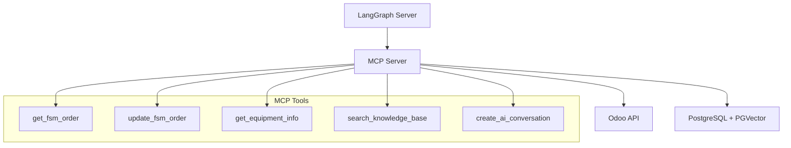
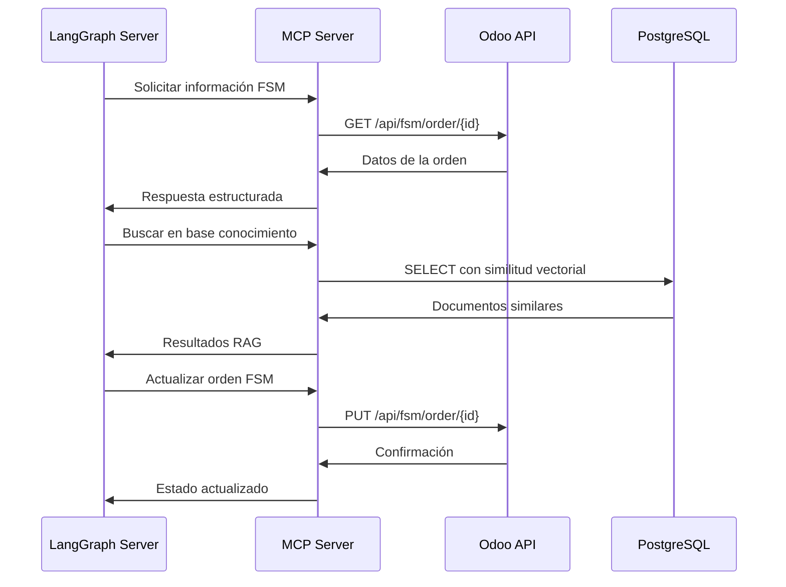

# Fase 4: Servidor MCP Básico - Implementación IA RAG

**Versión:** 1.0  
**Fecha:** Enero 2025  
**Duración Estimada:** 1 semana  
**Estado:** 🚧 En Implementación  
**Dependencias:** Fases 1, 2 y 3 completadas  

## 🎯 Objetivos de la Fase 4

### Objetivo Principal
Implementar un **Servidor MCP (Model Context Protocol)** que actúe como puente de comunicación bidireccional entre Odoo y los servicios de IA, proporcionando herramientas básicas para interactuar con órdenes FSM, equipos y la base de conocimiento.

### Objetivos Específicos
- ✅ Crear servidor MCP con protocolo estandarizado
- ✅ Implementar herramientas básicas para FSM y equipos
- ✅ Establecer comunicación segura con Odoo
- ✅ Validar conectividad bidireccional
- ✅ Integrar con docker-compose.yml existente

## 📋 Especificaciones del Servidor MCP

### Arquitectura del Servidor
El servidor MCP actúa como intermediario entre el sistema de IA (LangGraph) y Odoo, proporcionando un conjunto estandarizado de herramientas para acceder y modificar datos de manera segura.



### Protocolo MCP
- **Estándar**: Model Context Protocol de Anthropic
- **Transporte**: HTTP/WebSocket
- **Formato**: JSON-RPC 2.0
- **Autenticación**: API Key + Session tokens
- **Versionado**: Semantic versioning

## 🔧 Herramientas Básicas Requeridas

### 1. get_fsm_order
**Propósito**: Obtener información completa de una orden FSM

**Parámetros**:
- `order_id` (int): ID de la orden FSM
- `include_equipment` (bool): Incluir información de equipos
- `include_history` (bool): Incluir historial de servicios

**Respuesta**:
```json
{
  "id": 123,
  "name": "ORD/2025/001",
  "partner_name": "Cliente ABC",
  "location": "Sede Principal",
  "state": "assigned",
  "technician": {
    "id": 45,
    "name": "Juan Pérez",
    "skills": ["Refrigeración", "Electricidad"]
  },
  "equipment_ids": [67, 89],
  "description": "Mantenimiento preventivo",
  "scheduled_date": "2025-01-15T09:00:00Z"
}
```

### 2. update_fsm_order
**Propósito**: Actualizar estado y datos de una orden FSM

**Parámetros**:
- `order_id` (int): ID de la orden FSM
- `updates` (dict): Campos a actualizar
- `add_note` (str): Nota a agregar al chatter

**Campos actualizables**:
- `state`: Estado de la orden
- `worksheet_data`: Datos de la hoja de trabajo
- `duration`: Duración del servicio
- `materials_used`: Materiales utilizados

### 3. get_equipment_info
**Propósito**: Obtener información detallada de equipos

**Parámetros**:
- `equipment_id` (int): ID del equipo
- `include_manuals` (bool): Incluir manuales técnicos
- `include_history` (bool): Incluir historial de servicios

**Respuesta**:
```json
{
  "id": 67,
  "name": "Aire Acondicionado Central",
  "category": "HVAC",
  "model": "Carrier 30XA",
  "serial_number": "CAR123456",
  "location": "Piso 3 - Oficinas",
  "specifications": {
    "capacity": "5 TR",
    "refrigerant": "R410A",
    "voltage": "220V 3F"
  },
  "manuals": [
    {
      "id": 89,
      "name": "Manual de Instalación",
      "type": "manual",
      "url": "/web/content/89"
    }
  ]
}
```

### 4. search_knowledge_base
**Propósito**: Búsqueda semántica en la base de conocimiento

**Parámetros**:
- `query` (str): Consulta de búsqueda
- `equipment_category_ids` (list): Filtrar por categorías
- `document_types` (list): Tipos de documentos
- `similarity_threshold` (float): Umbral de similitud (0.7)
- `max_results` (int): Máximo resultados (10)

**Respuesta**:
```json
{
  "results": [
    {
      "document_id": 123,
      "title": "Procedimiento de Calibración",
      "content_snippet": "Para calibrar el termostato...",
      "similarity_score": 0.89,
      "document_type": "procedure",
      "equipment_categories": ["HVAC"]
    }
  ],
  "total_found": 5,
  "query_time_ms": 45
}
```

### 5. create_ai_conversation
**Propósito**: Crear nueva conversación IA para una orden FSM

**Parámetros**:
- `fsm_order_id` (int): ID de la orden FSM
- `technician_id` (int): ID del técnico
- `auto_start` (bool): Iniciar automáticamente

**Respuesta**:
```json
{
  "conversation_id": 456,
  "channel_id": 789,
  "state": "initiated",
  "channel_url": "/web#action=mail.action_discuss&active_id=789"
}
```

## 🏗️ Arquitectura de Comunicación

### Flujo de Comunicación Bidireccional



### Autenticación y Seguridad

#### Método de Autenticación
1. **API Key**: Clave estática para identificar el servicio MCP
2. **Session Token**: Token dinámico obtenido via login Odoo
3. **Rate Limiting**: Límites por minuto/hora
4. **IP Whitelisting**: Restricción por direcciones IP

#### Configuración de Seguridad
```python
# Configuración en Odoo
ODOO_AI_USER = "ai_agent_user"
ODOO_AI_PASSWORD = "secure_password_here"
MCP_API_KEY = "mcp_secret_key_2025"
ALLOWED_IPS = ["172.18.0.0/16"]  # Red Docker
```

## 🐳 Integración con Docker Compose

### Configuración del Servicio MCP

```yaml
# Adición al docker-compose.yml existente
services:
  mcp-server:
    build:
      context: ./ai-services/mcp
      dockerfile: Dockerfile
    container_name: patco-mcp-server
    depends_on:
      - odoo
      - db
    environment:
      - ODOO_URL=http://odoo:8069
      - ODOO_DB=odoo_patco
      - ODOO_USERNAME=${ODOO_AI_USER}
      - ODOO_PASSWORD=${ODOO_AI_PASSWORD}
      - MCP_API_KEY=${MCP_API_KEY}
      - DATABASE_URL=postgresql://odoo:P4tc0_2@db:5432/odoo_patco
      - LOG_LEVEL=INFO
    ports:
      - "8002:8002"
    volumes:
      - ./ai-services/mcp:/app
      - ./logs:/app/logs
    networks:
      - odoo-network
    restart: unless-stopped
    healthcheck:
      test: ["CMD", "curl", "-f", "http://localhost:8002/health"]
      interval: 30s
      timeout: 10s
      retries: 3
    profiles:
      - ai-services
```

### Perfil ai-services
El servicio MCP se incluye en el perfil `ai-services` para control granular:

```bash
# Iniciar solo servicios de IA
docker compose --profile ai-services up -d

# Iniciar servicio MCP específicamente
docker compose up -d mcp-server

# Ver logs del MCP
docker compose logs -f mcp-server
```

## ⚙️ Variables de Entorno y Configuración

### Variables Requeridas

| Variable | Descripción | Ejemplo |
|----------|-------------|----------|
| `ODOO_URL` | URL del servidor Odoo | `http://odoo:8069` |
| `ODOO_DB` | Base de datos Odoo | `odoo_patco` |
| `ODOO_USERNAME` | Usuario para API Odoo | `ai_agent_user` |
| `ODOO_PASSWORD` | Contraseña del usuario | `secure_password` |
| `MCP_API_KEY` | Clave API del servidor MCP | `mcp_secret_key_2025` |
| `DATABASE_URL` | URL PostgreSQL con PGVector | `postgresql://odoo:P4tc0_2@db:5432/odoo_patco` |

### Variables Opcionales

| Variable | Descripción | Valor por Defecto |
|----------|-------------|-------------------|
| `MCP_PORT` | Puerto del servidor MCP | `8002` |
| `LOG_LEVEL` | Nivel de logging | `INFO` |
| `MAX_CONNECTIONS` | Conexiones máximas | `100` |
| `REQUEST_TIMEOUT` | Timeout de requests (seg) | `30` |
| `RATE_LIMIT_PER_MINUTE` | Límite de requests/min | `60` |

### Archivo .env.ai
```bash
# Configuración del Servidor MCP
ODOO_AI_USER=ai_agent_user
ODOO_AI_PASSWORD=secure_password_here
MCP_API_KEY=mcp_secret_key_2025

# Configuración de Red
MCP_PORT=8002
ALLOWED_IPS=172.18.0.0/16

# Configuración de Performance
MAX_CONNECTIONS=100
REQUEST_TIMEOUT=30
RATE_LIMIT_PER_MINUTE=60

# Logging
LOG_LEVEL=INFO
LOG_FILE=/app/logs/mcp-server.log
```

## 🧪 Criterios de Aceptación y Validación

### Criterios Funcionales
- [ ] Servidor MCP responde en puerto 8002
- [ ] Autenticación exitosa con Odoo
- [ ] Herramienta `get_fsm_order` retorna datos correctos
- [ ] Herramienta `update_fsm_order` modifica órdenes
- [ ] Herramienta `get_equipment_info` accede a equipos
- [ ] Herramienta `search_knowledge_base` realiza búsqueda RAG
- [ ] Herramienta `create_ai_conversation` crea conversaciones
- [ ] Manejo de errores robusto
- [ ] Logging estructurado funcionando

### Criterios Técnicos
- [ ] Protocolo MCP implementado correctamente
- [ ] Comunicación JSON-RPC 2.0 válida
- [ ] Rate limiting configurado
- [ ] Healthcheck endpoint funcional
- [ ] Integración Docker Compose operativa
- [ ] Variables de entorno configuradas
- [ ] Permisos de seguridad aplicados

### Tests de Validación

#### Test 1: Conectividad Básica
```bash
# Verificar que el servidor responde
curl -f http://localhost:8002/health

# Verificar autenticación con Odoo
curl -X POST http://localhost:8002/auth/test \
  -H "Content-Type: application/json" \
  -d '{"api_key": "mcp_secret_key_2025"}'
```

#### Test 2: Herramientas MCP
```bash
# Test get_fsm_order
curl -X POST http://localhost:8002/mcp/call \
  -H "Content-Type: application/json" \
  -d '{
    "method": "get_fsm_order",
    "params": {"order_id": 1, "include_equipment": true}
  }'

# Test search_knowledge_base
curl -X POST http://localhost:8002/mcp/call \
  -H "Content-Type: application/json" \
  -d '{
    "method": "search_knowledge_base",
    "params": {"query": "calibración termostato", "max_results": 5}
  }'
```

#### Test 3: Integración Docker
```bash
# Verificar contenedor ejecutándose
docker compose ps mcp-server

# Verificar logs sin errores
docker compose logs mcp-server | grep -i error

# Verificar conectividad interna
docker exec patco-mcp-server curl -f http://odoo:8069/web/database/selector
```

## 📊 Estructura de Archivos del Servidor MCP

```
ai-services/mcp/
├── Dockerfile                  # Imagen Docker del servidor MCP
├── requirements.txt            # Dependencias Python
├── server.py                   # Servidor MCP principal
├── config.py                   # Configuración y variables
├── auth.py                     # Autenticación y seguridad
├── tools/                      # Herramientas MCP
│   ├── __init__.py
│   ├── fsm_tools.py           # Herramientas para FSM
│   ├── equipment_tools.py     # Herramientas para equipos
│   └── knowledge_tools.py     # Herramientas para RAG
├── schemas/                    # Esquemas de datos
│   ├── __init__.py
│   ├── fsm_schemas.py         # Esquemas FSM
│   ├── equipment_schemas.py   # Esquemas equipos
│   └── knowledge_schemas.py   # Esquemas RAG
├── utils/                      # Utilidades
│   ├── __init__.py
│   ├── odoo_client.py         # Cliente Odoo
│   ├── db_client.py           # Cliente PostgreSQL
│   └── validators.py          # Validadores
└── tests/                      # Tests unitarios
    ├── __init__.py
    ├── test_server.py
    ├── test_tools.py
    └── test_integration.py
```

## 🚀 Comandos de Implementación

### Construcción y Despliegue
```bash
# Construir imagen MCP
docker compose build mcp-server

# Iniciar servidor MCP
docker compose --profile ai-services up -d mcp-server

# Verificar estado
docker compose ps mcp-server

# Ver logs en tiempo real
docker compose logs -f mcp-server
```

### Debugging y Mantenimiento
```bash
# Acceder al contenedor
docker exec -it patco-mcp-server bash

# Ejecutar tests
docker exec patco-mcp-server python -m pytest tests/

# Verificar configuración
docker exec patco-mcp-server python -c "import config; print(config.ODOO_URL)"

# Reiniciar servicio
docker compose restart mcp-server
```

## 🔄 Próximos Pasos

### Al Completar Fase 4
1. **Validar** todas las herramientas MCP
2. **Documentar** endpoints y esquemas
3. **Crear** tests de integración
4. **Preparar** para Fase 5 (LangGraph Core)

### Fase 5: LangGraph Core (Siguiente)
- Servidor LangGraph con FastAPI
- Orquestador conversacional
- Integración con servidor MCP
- Estados persistentes en PostgreSQL
- Flujos conversacionales complejos

## ⚠️ Notas Importantes

### Seguridad
- **Nunca** exponer credenciales en logs
- **Usar** HTTPS en producción
- **Configurar** firewall para puerto 8002
- **Rotar** API keys regularmente

### Performance
- **Monitorear** uso de memoria y CPU
- **Configurar** connection pooling
- **Implementar** caching para consultas frecuentes
- **Optimizar** queries PostgreSQL

### Mantenimiento
- **Backup** regular de configuraciones
- **Actualizar** dependencias de seguridad
- **Monitorear** logs de errores
- **Documentar** cambios en API

---

**Estado de Implementación**: 🚧 En Progreso  
**Próxima Revisión**: Al completar implementación  
**Responsable**: Equipo de Desarrollo IA PATCO  