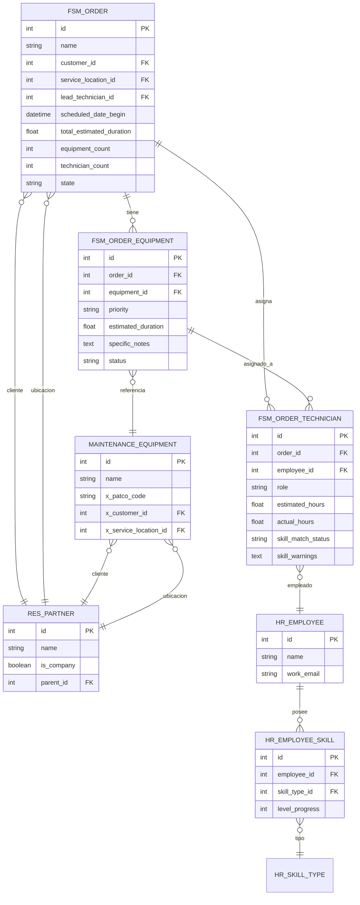
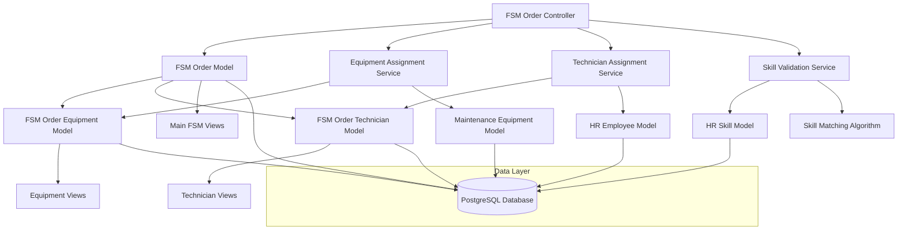
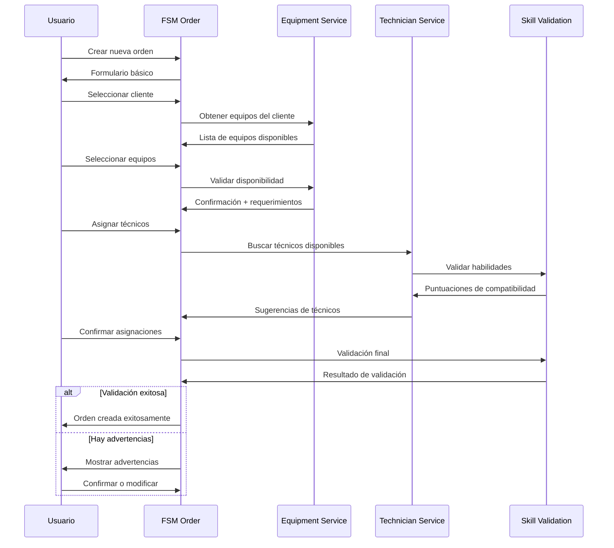
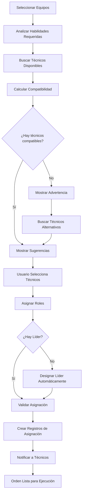

# Arquitectura Técnica: FSM Múltiples Activos y Técnicos

## 1. Arquitectura de Datos

### 1.1 Diagrama de Entidad-Relación



### 1.2 Definición de Tablas (DDL)

#### Tabla: fsm_order_equipment
```sql
CREATE TABLE fsm_order_equipment (
    id SERIAL PRIMARY KEY,
    order_id INTEGER NOT NULL REFERENCES fsm_order(id) ON DELETE CASCADE,
    equipment_id INTEGER NOT NULL REFERENCES maintenance_equipment(id),
    priority VARCHAR(20) DEFAULT 'normal' CHECK (priority IN ('low', 'normal', 'high')),
    estimated_duration NUMERIC(8,2) DEFAULT 0.0,
    specific_notes TEXT,
    status VARCHAR(20) DEFAULT 'pending' CHECK (status IN ('pending', 'in_progress', 'completed', 'blocked')),
    create_date TIMESTAMP WITH TIME ZONE DEFAULT NOW(),
    write_date TIMESTAMP WITH TIME ZONE DEFAULT NOW(),
    create_uid INTEGER REFERENCES res_users(id),
    write_uid INTEGER REFERENCES res_users(id),
    UNIQUE(order_id, equipment_id)
);

-- Índices para optimización
CREATE INDEX idx_fsm_order_equipment_order_id ON fsm_order_equipment(order_id);
CREATE INDEX idx_fsm_order_equipment_equipment_id ON fsm_order_equipment(equipment_id);
CREATE INDEX idx_fsm_order_equipment_status ON fsm_order_equipment(status);
```

#### Tabla: fsm_order_technician
```sql
CREATE TABLE fsm_order_technician (
    id SERIAL PRIMARY KEY,
    order_id INTEGER NOT NULL REFERENCES fsm_order(id) ON DELETE CASCADE,
    employee_id INTEGER NOT NULL REFERENCES hr_employee(id),
    role VARCHAR(20) NOT NULL CHECK (role IN ('leader', 'specialist', 'assistant', 'trainee')),
    estimated_hours NUMERIC(8,2) DEFAULT 0.0,
    actual_hours NUMERIC(8,2) DEFAULT 0.0,
    skill_match_status VARCHAR(20) DEFAULT 'adequate' CHECK (skill_match_status IN ('perfect', 'adequate', 'insufficient')),
    skill_warnings TEXT,
    create_date TIMESTAMP WITH TIME ZONE DEFAULT NOW(),
    write_date TIMESTAMP WITH TIME ZONE DEFAULT NOW(),
    create_uid INTEGER REFERENCES res_users(id),
    write_uid INTEGER REFERENCES res_users(id),
    UNIQUE(order_id, employee_id)
);

-- Índices para optimización
CREATE INDEX idx_fsm_order_technician_order_id ON fsm_order_technician(order_id);
CREATE INDEX idx_fsm_order_technician_employee_id ON fsm_order_technician(employee_id);
CREATE INDEX idx_fsm_order_technician_role ON fsm_order_technician(role);
```

#### Tabla de relación: fsm_order_technician_equipment_rel
```sql
CREATE TABLE fsm_order_technician_equipment_rel (
    technician_id INTEGER NOT NULL REFERENCES fsm_order_technician(id) ON DELETE CASCADE,
    equipment_id INTEGER NOT NULL REFERENCES fsm_order_equipment(id) ON DELETE CASCADE,
    PRIMARY KEY (technician_id, equipment_id)
);

-- Índices para optimización
CREATE INDEX idx_technician_equipment_rel_tech ON fsm_order_technician_equipment_rel(technician_id);
CREATE INDEX idx_technician_equipment_rel_equip ON fsm_order_technician_equipment_rel(equipment_id);
```

### 1.3 Modificaciones a Tabla Existente

#### Campos a agregar en fsm_order
```sql
ALTER TABLE fsm_order ADD COLUMN customer_id INTEGER REFERENCES res_partner(id);
ALTER TABLE fsm_order ADD COLUMN service_location_id INTEGER REFERENCES res_partner(id);
ALTER TABLE fsm_order ADD COLUMN lead_technician_id INTEGER REFERENCES hr_employee(id);
ALTER TABLE fsm_order ADD COLUMN total_estimated_duration NUMERIC(8,2) DEFAULT 0.0;
ALTER TABLE fsm_order ADD COLUMN equipment_count INTEGER DEFAULT 0;
ALTER TABLE fsm_order ADD COLUMN technician_count INTEGER DEFAULT 0;
ALTER TABLE fsm_order ADD COLUMN x_detailed_location TEXT;

-- Índices para nuevos campos
CREATE INDEX idx_fsm_order_customer_id ON fsm_order(customer_id);
CREATE INDEX idx_fsm_order_service_location_id ON fsm_order(service_location_id);
CREATE INDEX idx_fsm_order_lead_technician_id ON fsm_order(lead_technician_id);
```

## 2. Arquitectura de Aplicación

### 2.1 Diagrama de Componentes



### 2.2 Servicios y Componentes

#### Servicio de Asignación de Equipos
```python
class EquipmentAssignmentService:
    """Servicio para gestionar asignación de equipos a órdenes."""
    
    def assign_equipment_to_order(self, order_id, equipment_data):
        """Asignar múltiples equipos a una orden."""
        pass
    
    def validate_equipment_availability(self, equipment_ids, date_range):
        """Validar disponibilidad de equipos en rango de fechas."""
        pass
    
    def get_equipment_requirements(self, equipment_ids):
        """Obtener requerimientos de habilidades por equipo."""
        pass
```

#### Servicio de Asignación de Técnicos
```python
class TechnicianAssignmentService:
    """Servicio para gestionar asignación de técnicos."""
    
    def assign_technicians_to_order(self, order_id, technician_data):
        """Asignar múltiples técnicos con roles específicos."""
        pass
    
    def validate_technician_availability(self, employee_ids, date_range):
        """Validar disponibilidad de técnicos."""
        pass
    
    def suggest_technicians_for_skills(self, required_skills, location):
        """Sugerir técnicos basado en habilidades y ubicación."""
        pass
```

#### Servicio de Validación de Habilidades
```python
class SkillValidationService:
    """Servicio para validar compatibilidad de habilidades."""
    
    def validate_technician_skills(self, technician_id, required_skills):
        """Validar si técnico tiene habilidades requeridas."""
        pass
    
    def calculate_skill_match_score(self, technician_skills, required_skills):
        """Calcular puntuación de compatibilidad."""
        pass
    
    def generate_skill_warnings(self, assignments):
        """Generar advertencias de habilidades faltantes."""
        pass
```

## 3. APIs y Métodos

### 3.1 API REST Endpoints

#### Gestión de Órdenes
```python
# GET /api/fsm/orders/{id}/equipment
def get_order_equipment(self, order_id):
    """Obtener equipos asignados a una orden."""
    return {
        'equipment': [
            {
                'id': equipment.id,
                'name': equipment.equipment_id.name,
                'priority': equipment.priority,
                'status': equipment.status,
                'estimated_duration': equipment.estimated_duration,
                'assigned_technicians': [...]
            }
        ]
    }

# POST /api/fsm/orders/{id}/equipment
def assign_equipment_to_order(self, order_id, equipment_data):
    """Asignar equipos a una orden."""
    pass

# GET /api/fsm/orders/{id}/technicians
def get_order_technicians(self, order_id):
    """Obtener técnicos asignados a una orden."""
    return {
        'technicians': [
            {
                'id': technician.id,
                'name': technician.employee_id.name,
                'role': technician.role,
                'skill_match': technician.skill_match_status,
                'assigned_equipment': [...]
            }
        ]
    }
```

### 3.2 Métodos del Modelo Principal

#### FSM Order - Métodos Extendidos
```python
class FsmOrder(models.Model):
    _inherit = 'fsm.order'
    
    def action_assign_multiple_technicians(self):
        """Abrir wizard para asignación múltiple de técnicos."""
        return {
            'type': 'ir.actions.act_window',
            'name': 'Asignar Técnicos',
            'res_model': 'fsm.technician.assignment.wizard',
            'view_mode': 'form',
            'target': 'new',
            'context': {'default_order_id': self.id}
        }
    
    def action_validate_skill_requirements(self):
        """Validar que todos los equipos tengan técnicos con habilidades adecuadas."""
        validation_service = self.env['skill.validation.service']
        results = validation_service.validate_order_assignments(self)
        
        if results['has_warnings']:
            return {
                'type': 'ir.actions.act_window',
                'name': 'Advertencias de Habilidades',
                'res_model': 'skill.validation.report',
                'view_mode': 'form',
                'target': 'new',
                'context': {'default_validation_data': results}
            }
    
    def action_optimize_technician_assignment(self):
        """Optimizar asignación de técnicos basado en habilidades y ubicación."""
        optimization_service = self.env['technician.optimization.service']
        suggestions = optimization_service.suggest_optimal_assignment(self)
        
        return {
            'type': 'ir.actions.act_window',
            'name': 'Sugerencias de Optimización',
            'res_model': 'technician.optimization.wizard',
            'view_mode': 'form',
            'target': 'new',
            'context': {'default_suggestions': suggestions}
        }
```

## 4. Flujos de Trabajo

### 4.1 Flujo de Creación de Orden



### 4.2 Flujo de Asignación de Técnicos



## 5. Consideraciones de Rendimiento

### 5.1 Optimizaciones de Base de Datos

#### Índices Estratégicos
```sql
-- Índices compuestos para consultas frecuentes
CREATE INDEX idx_fsm_order_customer_date ON fsm_order(customer_id, scheduled_date_begin);
CREATE INDEX idx_equipment_customer_status ON maintenance_equipment(x_customer_id, maintenance_state);
CREATE INDEX idx_technician_role_order ON fsm_order_technician(role, order_id);

-- Índices parciales para estados activos
CREATE INDEX idx_fsm_order_active ON fsm_order(id) WHERE state IN ('confirmed', 'in_progress');
CREATE INDEX idx_equipment_active ON fsm_order_equipment(order_id) WHERE status != 'completed';
```

#### Consultas Optimizadas
```python
# Usar prefetch para evitar N+1 queries
def get_order_with_details(self, order_id):
    return self.env['fsm.order'].browse(order_id).with_context(
        prefetch_fields=[
            'equipment_ids.equipment_id.name',
            'technician_ids.employee_id.name',
            'technician_ids.assigned_equipment_ids'
        ]
    )

# Usar read_group para agregaciones
def get_technician_workload(self, date_from, date_to):
    return self.env['fsm.order.technician'].read_group(
        domain=[
            ('order_id.scheduled_date_begin', '>=', date_from),
            ('order_id.scheduled_date_begin', '<=', date_to)
        ],
        fields=['employee_id', 'estimated_hours:sum'],
        groupby=['employee_id']
    )
```

### 5.2 Caché y Almacenamiento

#### Campos Computados con Store
```python
# Campos críticos que se consultan frecuentemente
total_estimated_duration = fields.Float(
    compute='_compute_total_duration',
    store=True,  # Almacenar para consultas rápidas
    index=True   # Índice para ordenamiento
)

equipment_count = fields.Integer(
    compute='_compute_equipment_count',
    store=True
)

skill_match_status = fields.Selection(
    compute='_compute_skill_match',
    store=True,  # Evitar recálculo constante
    index=True   # Para filtros rápidos
)
```

## 6. Seguridad y Permisos

### 6.1 Reglas de Acceso

#### ir.model.access.csv
```csv
id,name,model_id:id,group_id:id,perm_read,perm_write,perm_create,perm_unlink
access_fsm_order_equipment_user,fsm.order.equipment.user,model_fsm_order_equipment,base.group_user,1,1,1,0
access_fsm_order_equipment_manager,fsm.order.equipment.manager,model_fsm_order_equipment,base.group_system,1,1,1,1
access_fsm_order_technician_user,fsm.order.technician.user,model_fsm_order_technician,base.group_user,1,1,1,0
access_fsm_order_technician_manager,fsm.order.technician.manager,model_fsm_order_technician,base.group_system,1,1,1,1
```

#### Reglas de Registro (ir.rule)
```xml
<!-- Técnicos solo ven sus propias asignaciones -->
<record id="rule_fsm_technician_own" model="ir.rule">
    <field name="name">FSM Technician: Own Records</field>
    <field name="model_id" ref="model_fsm_order_technician"/>
    <field name="domain_force">[('employee_id.user_id', '=', user.id)]</field>
    <field name="groups" eval="[(4, ref('base.group_user'))]"/>
</record>

<!-- Supervisores ven todas las asignaciones de su área -->
<record id="rule_fsm_technician_supervisor" model="ir.rule">
    <field name="name">FSM Technician: Supervisor Access</field>
    <field name="model_id" ref="model_fsm_order_technician"/>
    <field name="domain_force">[('order_id.x_area_id.supervisor_id', '=', user.employee_id.id)]</field>
    <field name="groups" eval="[(4, ref('patco_fsm.group_fsm_supervisor'))]"/>
</record>
```

### 6.2 Validaciones de Seguridad

```python
@api.model
def create(self, vals):
    """Validar permisos antes de crear asignación."""
    # Solo supervisores pueden asignar técnicos
    if not self.env.user.has_group('patco_fsm.group_fsm_supervisor'):
        if vals.get('role') == 'leader':
            raise AccessError("Solo supervisores pueden asignar líderes técnicos.")
    
    return super().create(vals)

@api.constrains('employee_id', 'order_id')
def _check_assignment_permissions(self):
    """Validar que el usuario puede asignar este técnico."""
    for record in self:
        if not record.env.user.has_group('base.group_system'):
            # Validar que el técnico pertenece al área del supervisor
            supervisor_area = record.env.user.employee_id.department_id
            technician_area = record.employee_id.department_id
            
            if supervisor_area != technician_area:
                raise ValidationError(
                    f"No puede asignar técnicos de otras áreas. "
                    f"Técnico: {technician_area.name}, Su área: {supervisor_area.name}"
                )
```

---

*Documento de Arquitectura Técnica para Proyecto PATCO - Odoo 18 Community Edition*
*Versión: 1.0 | Fecha: Diciembre 2024*