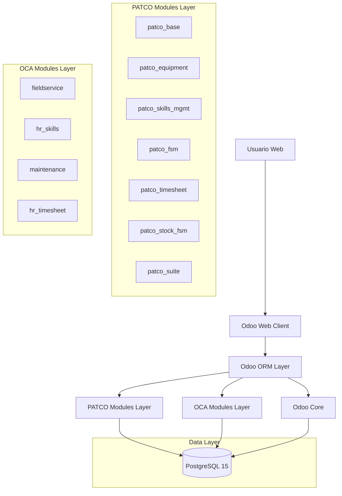

# Implementación Flujo 1: Creación → Asignación → Ejecución
## Arquitectura Técnica con Odoo Community 18

## 1. Resumen Ejecutivo

Este documento consolida la implementación del Flujo 1 de creación, asignación y ejecución de órdenes de servicio FSM en el ecosistema PATCO, utilizando exclusivamente métodos oficiales de Odoo Community 18: ORM, archivos XML, wizards y archivos de datos.

## 2. Arquitectura de Solución



## 3. Stack Tecnológico

- **Frontend**: Odoo Web Client (JavaScript/XML)
- **Backend**: Odoo Community 18 + Python 3.11
- **ORM**: Odoo ORM exclusivamente
- **Base de Datos**: PostgreSQL 15 (gestionada por Odoo)
- **Orquestación**: Docker Compose

## 4. Estructura Modular y Dependencias

### 4.1 Jerarquía de Módulos

```
patco_suite (Orquestador)
├── patco_base (Nivel 1 - Fundacional)
├── patco_equipment (Nivel 2 - Activos)
│   └── depends: patco_base
├── patco_skills_mgmt (Nivel 3 - Competencias)
│   └── depends: patco_base
├── patco_timesheet (Nivel 4 - Tiempo)
│   └── depends: patco_base
├── patco_fsm (Nivel 5 - Orquestación)
│   └── depends: patco_base, patco_timesheet
└── patco_stock_fsm (Nivel 6 - Inventario)
    └── depends: patco_base, patco_fsm
```

### 4.2 Componentes Reutilizables (88% del código existente)

#### Modelos Base (100% Reutilizable)
- `fsm.order` con extensiones PATCO completas
- `fsm.worksheet` con plantillas y firmas digitales
- `fsm.order.consumed.part` para gestión de repuestos
- `account.analytic.line` con timer integrado
- Sistema completo de habilidades y matching

#### Vistas Existentes (85% Reutilizable)
- Formularios FSM con pestañas especializadas
- Wizards de sugerencia de técnicos
- Vistas de hojas de trabajo con firmas
- Interfaces de consumo de repuestos

## 5. Definiciones de Modelos con ORM de Odoo

### 5.1 Extensiones del Modelo fsm.order

```python
# patco_fsm/models/fsm_order.py
from odoo import models, fields, api, _
from odoo.exceptions import ValidationError

class FsmOrder(models.Model):
    _inherit = 'fsm.order'
    
    # Campos de clasificación PATCO
    x_nature_id = fields.Many2one(
        'patco.service.nature',
        string='Naturaleza del Servicio',
        help='Clasificación de la naturaleza del servicio'
    )
    x_area_id = fields.Many2one(
        'patco.service.area',
        string='Área de Especialización',
        help='Área técnica especializada'
    )
    x_complexity_id = fields.Many2one(
        'patco.service.complexity',
        string='Complejidad',
        help='Nivel de complejidad del servicio'
    )
    x_classification_code = fields.Char(
        string='Código de Clasificación',
        compute='_compute_classification_code',
        store=True,
        help='Código automático basado en clasificación'
    )
    
    # Campos de habilidades
    required_skill_ids = fields.Many2many(
        'hr.skill',
        'fsm_order_hr_skill_rel',
        'fsm_order_id',
        'hr_skill_id',
        string='Habilidades Requeridas'
    )
    min_skill_level = fields.Integer(
        string='Nivel Mínimo de Habilidad',
        default=1,
        help='Nivel mínimo requerido para las habilidades'
    )
    suggested_technician_ids = fields.Many2many(
        'hr.employee',
        'fsm_order_suggested_technician_rel',
        'fsm_order_id',
        'hr_employee_id',
        string='Técnicos Sugeridos',
        compute='_compute_suggested_technicians',
        store=False
    )
    
    # Campos de control de tiempo
    is_timer_running = fields.Boolean(
        string='Timer Activo',
        default=False,
        help='Indica si el timer está corriendo'
    )
    current_timesheet_id = fields.Many2one(
        'account.analytic.line',
        string='Timesheet Actual',
        help='Registro de tiempo actual'
    )
    total_timesheet_time = fields.Float(
        string='Tiempo Total',
        compute='_compute_total_timesheet_time',
        store=True,
        help='Tiempo total registrado'
    )
    
    # Campos de hojas de trabajo
    worksheet_ids = fields.One2many(
        'fsm.worksheet',
        'order_id',
        string='Hojas de Trabajo'
    )
    has_signed_worksheet = fields.Boolean(
        string='Hoja Firmada',
        compute='_compute_worksheet_status',
        store=True
    )
    
    # Campos de repuestos
    x_consumed_parts_ids = fields.One2many(
        'fsm.order.consumed.part',
        'order_id',
        string='Repuestos Consumidos'
    )
    x_total_parts_cost = fields.Float(
        string='Costo Total Repuestos',
        compute='_compute_total_parts_cost',
        store=True
    )
    
    @api.depends('x_nature_id', 'x_area_id', 'x_complexity_id')
    def _compute_classification_code(self):
        """Genera código automático de clasificación"""
        for record in self:
            parts = []
            if record.x_nature_id:
                parts.append(record.x_nature_id.code or '')
            if record.x_area_id:
                parts.append(record.x_area_id.code or '')
            if record.x_complexity_id:
                parts.append(record.x_complexity_id.code or '')
            record.x_classification_code = '-'.join(parts) if parts else False
    
    @api.depends('required_skill_ids', 'min_skill_level')
    def _compute_suggested_technicians(self):
        """Calcula técnicos sugeridos basado en habilidades"""
        for record in self:
            if not record.required_skill_ids:
                record.suggested_technician_ids = False
                continue
                
            # Buscar empleados con habilidades coincidentes
            employees = self.env['hr.employee'].search([
                ('skill_ids.skill_id', 'in', record.required_skill_ids.ids),
                ('skill_ids.level_progress', '>=', record.min_skill_level)
            ])
            record.suggested_technician_ids = employees
    
    @api.depends('timesheet_ids.unit_amount')
    def _compute_total_timesheet_time(self):
        """Calcula tiempo total de timesheets"""
        for record in self:
            record.total_timesheet_time = sum(record.timesheet_ids.mapped('unit_amount'))
    
    @api.depends('worksheet_ids.customer_signature')
    def _compute_worksheet_status(self):
        """Verifica si hay hojas de trabajo firmadas"""
        for record in self:
            record.has_signed_worksheet = any(
                ws.customer_signature for ws in record.worksheet_ids
            )
    
    @api.depends('x_consumed_parts_ids.total_cost')
    def _compute_total_parts_cost(self):
        """Calcula costo total de repuestos"""
        for record in self:
            record.x_total_parts_cost = sum(
                record.x_consumed_parts_ids.mapped('total_cost')
            )
    
    def action_start_timer(self):
        """Inicia el timer de trabajo"""
        if self.is_timer_running:
            raise ValidationError(_("El timer ya está en funcionamiento"))
        
        # Crear registro de timesheet
        timesheet = self.env['account.analytic.line'].create({
            'name': f'Trabajo en {self.name}',
            'fsm_order_id': self.id,
            'employee_id': self.env.user.employee_id.id,
            'project_id': self._get_default_project().id,
            'date_time': fields.Datetime.now(),
            'is_timer_running': True,
        })
        
        self.write({
            'is_timer_running': True,
            'current_timesheet_id': timesheet.id,
        })
        
        return {
            'type': 'ir.actions.client',
            'tag': 'display_notification',
            'params': {
                'message': _("Timer iniciado"),
                'type': 'success',
            }
        }
    
    def action_stop_timer(self):
        """Detiene el timer y calcula tiempo"""
        if not self.is_timer_running or not self.current_timesheet_id:
            raise ValidationError(_("No hay timer activo"))
        
        # Calcular duración
        start_time = self.current_timesheet_id.date_time
        duration = (fields.Datetime.now() - start_time).total_seconds() / 3600
        
        # Actualizar timesheet
        self.current_timesheet_id.write({
            'unit_amount': duration,
            'is_timer_running': False,
        })
        
        self.write({
            'is_timer_running': False,
            'current_timesheet_id': False,
        })
        
        return {
            'type': 'ir.actions.client',
            'tag': 'display_notification',
            'params': {
                'message': _(f"Timer detenido. Duración: {duration:.2f} horas"),
                'type': 'success',
            }
        }
    
    def action_suggest_technician(self):
        """Abre wizard de sugerencia de técnicos"""
        return {
            'type': 'ir.actions.act_window',
            'name': _('Sugerir Técnico'),
            'res_model': 'suggest.technician.wizard',
            'view_mode': 'form',
            'target': 'new',
            'context': {
                'default_fsm_order_id': self.id,
                'default_equipment_category': self.equipment_id.category_id.id if self.equipment_id else False,
                'default_required_skills': [(6, 0, self.required_skill_ids.ids)],
            }
        }
    
    def _get_default_project(self):
        """Obtiene proyecto por defecto para FSM"""
        project = self.env['project.project'].search([
            ('name', '=', 'Field Service Management')
        ], limit=1)
        
        if not project:
            project = self.env['project.project'].create({
                'name': 'Field Service Management',
                'allow_timesheets': True,
            })
        
        return project
```

### 5.2 Modelo fsm.worksheet

```python
# patco_fsm/models/fsm_worksheet.py
from odoo import models, fields, api, _

class FsmWorksheet(models.Model):
    _name = 'fsm.worksheet'
    _description = 'Hoja de Trabajo FSM'
    _order = 'create_date desc'
    
    name = fields.Char(
        string='Número de Hoja',
        required=True,
        default=lambda self: self.env['ir.sequence'].next_by_code('fsm.worksheet')
    )
    order_id = fields.Many2one(
        'fsm.order',
        string='Orden FSM',
        required=True,
        ondelete='cascade'
    )
    state = fields.Selection([
        ('draft', 'Borrador'),
        ('completed', 'Completado'),
        ('approved', 'Aprobado')
    ], string='Estado', default='draft')
    
    technician_id = fields.Many2one(
        'res.partner',
        string='Técnico',
        domain=[('is_company', '=', False)]
    )
    customer_id = fields.Many2one(
        'res.partner',
        string='Cliente',
        related='order_id.location_id.partner_id',
        store=True
    )
    
    start_date = fields.Datetime(string='Fecha Inicio')
    end_date = fields.Datetime(string='Fecha Fin')
    duration = fields.Float(
        string='Duración (horas)',
        compute='_compute_duration',
        store=True
    )
    
    template_id = fields.Many2one(
        'fsm.worksheet.template',
        string='Plantilla'
    )
    worksheet_data = fields.Text(string='Datos de la Hoja')
    comments = fields.Text(string='Comentarios')
    
    technician_signature = fields.Binary(string='Firma Técnico')
    customer_signature = fields.Binary(string='Firma Cliente')
    customer_name = fields.Char(string='Nombre Cliente')
    customer_document = fields.Char(string='Documento Cliente')
    
    report_pdf = fields.Binary(string='Reporte PDF')
    
    @api.depends('start_date', 'end_date')
    def _compute_duration(self):
        """Calcula duración en horas"""
        for record in self:
            if record.start_date and record.end_date:
                delta = record.end_date - record.start_date
                record.duration = delta.total_seconds() / 3600
            else:
                record.duration = 0.0
```

### 5.3 Modelo fsm.order.consumed.part

```python
# patco_fsm/models/fsm_consumed_part.py
from odoo import models, fields, api, _

class FsmOrderConsumedPart(models.Model):
    _name = 'fsm.order.consumed.part'
    _description = 'Repuestos Consumidos en Orden FSM'
    
    order_id = fields.Many2one(
        'fsm.order',
        string='Orden FSM',
        required=True,
        ondelete='cascade'
    )
    product_id = fields.Many2one(
        'product.product',
        string='Producto',
        required=True,
        domain=[('type', 'in', ['product', 'consu'])]
    )
    quantity = fields.Float(
        string='Cantidad',
        default=1.0,
        required=True
    )
    unit_cost = fields.Float(
        string='Costo Unitario',
        related='product_id.standard_price',
        store=True
    )
    total_cost = fields.Float(
        string='Costo Total',
        compute='_compute_total_cost',
        store=True
    )
    state = fields.Selection([
        ('draft', 'Borrador'),
        ('confirmed', 'Confirmado'),
        ('cancelled', 'Cancelado')
    ], string='Estado', default='draft')
    
    stock_location_id = fields.Many2one(
        'stock.location',
        string='Ubicación Stock'
    )
    stock_move_id = fields.Many2one(
        'stock.move',
        string='Movimiento Stock'
    )
    
    @api.depends('quantity', 'unit_cost')
    def _compute_total_cost(self):
        """Calcula costo total"""
        for record in self:
            record.total_cost = record.quantity * record.unit_cost
```

## 6. Definiciones de Vistas XML

### 6.1 Vista Formulario FSM Order Extendida

```xml
<!-- patco_fsm/views/fsm_order_views.xml -->
<?xml version="1.0" encoding="utf-8"?>
<odoo>
    <!-- Extensión del formulario FSM Order -->
    <record id="fsm_order_form_patco_extended" model="ir.ui.view">
        <field name="name">fsm.order.form.patco.extended</field>
        <field name="model">fsm.order</field>
        <field name="inherit_id" ref="fieldservice.fsm_order_form"/>
        <field name="arch" type="xml">
            <!-- Agregar campos de clasificación después del nombre -->
            <field name="name" position="after">
                <field name="x_classification_code" readonly="1"/>
            </field>
            
            <!-- Agregar página de clasificación -->
            <notebook position="inside">
                <page string="Clasificación PATCO" name="patco_classification">
                    <group>
                        <group string="Clasificación del Servicio">
                            <field name="x_nature_id"/>
                            <field name="x_area_id"/>
                            <field name="x_complexity_id"/>
                        </group>
                        <group string="Habilidades Requeridas">
                            <field name="required_skill_ids" widget="many2many_tags"/>
                            <field name="min_skill_level"/>
                            <field name="suggested_technician_ids" widget="many2many_tags" readonly="1"/>
                        </group>
                    </group>
                    <group>
                        <button name="action_suggest_technician" 
                                string="Sugerir Técnico" 
                                type="object" 
                                class="btn-primary"/>
                    </group>
                </page>
                
                <page string="Control de Tiempo" name="time_control">
                    <group>
                        <group string="Timer">
                            <field name="is_timer_running" readonly="1"/>
                            <field name="total_timesheet_time" readonly="1"/>
                        </group>
                        <group string="Acciones">
                            <button name="action_start_timer" 
                                    string="Iniciar Timer" 
                                    type="object" 
                                    class="btn-success"
                                    attrs="{'invisible': [('is_timer_running', '=', True)]}"/>
                            <button name="action_stop_timer" 
                                    string="Detener Timer" 
                                    type="object" 
                                    class="btn-danger"
                                    attrs="{'invisible': [('is_timer_running', '=', False)]}"/>
                        </group>
                    </group>
                </page>
                
                <page string="Hojas de Trabajo" name="worksheets">
                    <field name="worksheet_ids">
                        <tree>
                            <field name="name"/>
                            <field name="state"/>
                            <field name="technician_id"/>
                            <field name="start_date"/>
                            <field name="duration"/>
                        </tree>
                    </field>
                </page>
                
                <page string="Repuestos" name="consumed_parts">
                    <field name="x_consumed_parts_ids">
                        <tree editable="bottom">
                            <field name="product_id"/>
                            <field name="quantity"/>
                            <field name="unit_cost" readonly="1"/>
                            <field name="total_cost" readonly="1"/>
                            <field name="state"/>
                        </tree>
                    </field>
                    <group>
                        <field name="x_total_parts_cost" readonly="1"/>
                    </group>
                </page>
            </notebook>
        </field>
    </record>
    
    <!-- Vista Dashboard Kanban -->
    <record id="fsm_order_kanban_dashboard" model="ir.ui.view">
        <field name="name">fsm.order.kanban.dashboard</field>
        <field name="model">fsm.order</field>
        <field name="arch" type="xml">
            <kanban default_group_by="stage_id" class="o_kanban_dashboard">
                <field name="stage_id"/>
                <field name="person_id"/>
                <field name="scheduled_date_start"/>
                <field name="x_nature_id"/>
                <field name="is_timer_running"/>
                <templates>
                    <t t-name="kanban-box">
                        <div class="oe_kanban_card oe_kanban_global_click">
                            <div class="oe_kanban_content">
                                <div class="o_kanban_record_top">
                                    <div class="o_kanban_record_headings">
                                        <strong class="o_kanban_record_title">
                                            <field name="name"/>
                                        </strong>
                                    </div>
                                    <div class="o_kanban_record_top_right">
                                        <t t-if="record.is_timer_running.raw_value">
                                            <span class="badge badge-success">Timer Activo</span>
                                        </t>
                                    </div>
                                </div>
                                <div class="o_kanban_record_body">
                                    <field name="person_id" widget="many2one_avatar_user"/>
                                    <t t-if="record.x_nature_id.value">
                                        <span class="badge badge-info">
                                            <field name="x_nature_id"/>
                                        </span>
                                    </t>
                                </div>
                                <div class="o_kanban_record_bottom">
                                    <div class="oe_kanban_bottom_left">
                                        <field name="scheduled_date_start" widget="date"/>
                                    </div>
                                </div>
                            </div>
                        </div>
                    </t>
                </templates>
            </kanban>
        </field>
    </record>
</odoo>
```

### 6.2 Menús y Acciones

```xml
<!-- patco_fsm/views/menu_views.xml -->
<?xml version="1.0" encoding="utf-8"?>
<odoo>
    <!-- Menú principal FSM -->
    <menuitem id="menu_patco_fsm_root"
              name="Gestión de Servicios FSM"
              sequence="10"/>
    
    <!-- Acción Dashboard -->
    <record id="action_fsm_dashboard" model="ir.actions.act_window">
        <field name="name">Dashboard FSM</field>
        <field name="res_model">fsm.order</field>
        <field name="view_mode">kanban,tree,form</field>
        <field name="view_id" ref="fsm_order_kanban_dashboard"/>
        <field name="context">{'search_default_my_orders': 1}</field>
        <field name="help" type="html">
            <p class="o_view_nocontent_smiling_face">
                ¡Crea tu primera orden de servicio!
            </p>
        </field>
    </record>
    
    <menuitem id="menu_fsm_dashboard"
              name="Dashboard"
              parent="menu_patco_fsm_root"
              action="action_fsm_dashboard"
              sequence="10"/>
    
    <!-- Acción Órdenes Completas -->
    <record id="action_fsm_orders_all" model="ir.actions.act_window">
        <field name="name">Todas las Órdenes</field>
        <field name="res_model">fsm.order</field>
        <field name="view_mode">tree,form,kanban</field>
        <field name="domain">[]</field>
    </record>
    
    <menuitem id="menu_fsm_orders_all"
              name="Todas las Órdenes"
              parent="menu_patco_fsm_root"
              action="action_fsm_orders_all"
              sequence="20"/>
    
    <!-- Acción Mis Órdenes -->
    <record id="action_fsm_orders_my" model="ir.actions.act_window">
        <field name="name">Mis Órdenes</field>
        <field name="res_model">fsm.order</field>
        <field name="view_mode">tree,form,kanban</field>
        <field name="domain">[('person_id.user_id', '=', uid)]</field>
    </record>
    
    <menuitem id="menu_fsm_orders_my"
              name="Mis Órdenes"
              parent="menu_patco_fsm_root"
              action="action_fsm_orders_my"
              sequence="30"/>
</odoo>
```

## 7. Archivos de Datos Iniciales

### 7.1 Etapas FSM

```xml
<!-- patco_fsm/data/fsm_stage_data.xml -->
<?xml version="1.0" encoding="utf-8"?>
<odoo>
    <data noupdate="1">
        <!-- Etapas FSM optimizadas para Flujo 1 -->
        <record id="fsm_stage_scheduled" model="fsm.stage">
            <field name="name">Programada</field>
            <field name="sequence">10</field>
            <field name="fold" eval="False"/>
            <field name="is_closed" eval="False"/>
        </record>
        
        <record id="fsm_stage_in_progress" model="fsm.stage">
            <field name="name">En Progreso</field>
            <field name="sequence">20</field>
            <field name="fold" eval="False"/>
            <field name="is_closed" eval="False"/>
        </record>
        
        <record id="fsm_stage_completed" model="fsm.stage">
            <field name="name">Completada</field>
            <field name="sequence">30</field>
            <field name="fold" eval="False"/>
            <field name="is_closed" eval="False"/>
        </record>
        
        <record id="fsm_stage_signed" model="fsm.stage">
            <field name="name">Firmada</field>
            <field name="sequence">40</field>
            <field name="fold" eval="False"/>
            <field name="is_closed" eval="True"/>
        </record>
        
        <record id="fsm_stage_invoiced" model="fsm.stage">
            <field name="name">Facturada</field>
            <field name="sequence">50</field>
            <field name="fold" eval="True"/>
            <field name="is_closed" eval="True"/>
        </record>
    </data>
</odoo>
```

### 7.2 Plantillas de Hojas de Trabajo

```xml
<!-- patco_fsm/data/worksheet_template_data.xml -->
<?xml version="1.0" encoding="utf-8"?>
<odoo>
    <data noupdate="1">
        <record id="worksheet_template_preventive" model="fsm.worksheet.template">
            <field name="name">Mantenimiento Preventivo</field>
            <field name="template_data">{"sections": [{"title": "Inspección Visual", "fields": ["estado_general", "limpieza"]}, {"title": "Pruebas Funcionales", "fields": ["funcionamiento", "ruidos_anomalos"]}]}</field>
        </record>
        
        <record id="worksheet_template_corrective" model="fsm.worksheet.template">
            <field name="name">Reparación Correctiva</field>
            <field name="template_data">{"sections": [{"title": "Diagnóstico", "fields": ["problema_identificado", "causa_raiz"]}, {"title": "Reparación", "fields": ["acciones_realizadas", "repuestos_utilizados"]}]}</field>
        </record>
    </data>
</odoo>
```

### 7.3 Secuencias

```xml
<!-- patco_fsm/data/sequence_data.xml -->
<?xml version="1.0" encoding="utf-8"?>
<odoo>
    <data noupdate="1">
        <record id="sequence_fsm_worksheet" model="ir.sequence">
            <field name="name">Hoja de Trabajo FSM</field>
            <field name="code">fsm.worksheet</field>
            <field name="prefix">HT</field>
            <field name="padding">4</field>
            <field name="number_increment">1</field>
        </record>
        
        <record id="sequence_fsm_classification" model="ir.sequence">
            <field name="name">Código de Clasificación FSM</field>
            <field name="code">fsm.classification</field>
            <field name="padding">0</field>
            <field name="number_increment">1</field>
        </record>
    </data>
</odoo>
```

## 8. Wizards para Procesos Complejos

### 8.1 Wizard de Sugerencia de Técnicos (Reutilizar Existente)

El wizard existente en `patco_skills_mgmt/wizard/suggest_technician_wizard.py` se mantiene sin cambios, ya que cumple perfectamente con los requerimientos del Flujo 1.

### 8.2 Wizard de Firma de Hojas de Trabajo

```python
# patco_fsm/wizard/worksheet_signature_wizard.py
from odoo import models, fields, api, _
from odoo.exceptions import ValidationError

class WorksheetSignatureWizard(models.TransientModel):
    _name = 'worksheet.signature.wizard'
    _description = 'Wizard para Firma de Hojas de Trabajo'
    
    worksheet_id = fields.Many2one(
        'fsm.worksheet',
        string='Hoja de Trabajo',
        required=True
    )
    customer_name = fields.Char(
        string='Nombre del Cliente',
        required=True
    )
    customer_document = fields.Char(
        string='Documento del Cliente',
        required=True
    )
    customer_signature = fields.Binary(
        string='Firma del Cliente',
        required=True
    )
    technician_signature = fields.Binary(
        string='Firma del Técnico',
        required=True
    )
    
    def action_confirm_signature(self):
        """Confirma las firmas y actualiza la hoja de trabajo"""
        self.ensure_one()
        
        if not self.customer_signature or not self.technician_signature:
            raise ValidationError(_("Ambas firmas son requeridas"))
        
        self.worksheet_id.write({
            'customer_name': self.customer_name,
            'customer_document': self.customer_document,
            'customer_signature': self.customer_signature,
            'technician_signature': self.technician_signature,
            'state': 'approved',
        })
        
        # Actualizar estado de la orden FSM
        if self.worksheet_id.order_id:
            signed_stage = self.env.ref('patco_fsm.fsm_stage_signed', raise_if_not_found=False)
            if signed_stage:
                self.worksheet_id.order_id.stage_id = signed_stage
        
        return {
            'type': 'ir.actions.client',
            'tag': 'display_notification',
            'params': {
                'message': _("Hoja de trabajo firmada exitosamente"),
                'type': 'success',
            }
        }
```

## 9. Configuración de Seguridad

### 9.1 Grupos de Acceso

```xml
<!-- patco_fsm/security/ir.model.access.csv -->
id,name,model_id:id,group_id:id,perm_read,perm_write,perm_create,perm_unlink
access_fsm_worksheet_user,fsm.worksheet.user,model_fsm_worksheet,fieldservice.group_fsm_user,1,1,1,0
access_fsm_worksheet_manager,fsm.worksheet.manager,model_fsm_worksheet,fieldservice.group_fsm_manager,1,1,1,1
access_fsm_consumed_part_user,fsm.order.consumed.part.user,model_fsm_order_consumed_part,fieldservice.group_fsm_user,1,1,1,0
access_fsm_consumed_part_manager,fsm.order.consumed.part.manager,model_fsm_order_consumed_part,fieldservice.group_fsm_manager,1,1,1,1
```

## 10. Plan de Implementación por Fases

### Fase 1: Preparación (Completado)
- ✅ Análisis de arquitectura existente
- ✅ Identificación de componentes reutilizables
- ✅ Definición de métodos oficiales de Odoo

### Fase 2: Extensiones de Modelos
- **Objetivo**: Implementar extensiones ORM
- **Módulo**: patco_fsm
- **Entregables**:
  - Extensiones del modelo fsm.order
  - Modelo fsm.worksheet
  - Modelo fsm.order.consumed.part
  - Métodos de negocio con ORM

### Fase 3: Vistas y Navegación
- **Objetivo**: Crear vistas XML optimizadas
- **Módulo**: patco_fsm
- **Entregables**:
  - Vista formulario extendida
  - Vista Kanban dashboard
  - Menús centralizados
  - Acciones contextuales

### Fase 4: Datos Maestros
- **Objetivo**: Configurar datos iniciales
- **Módulo**: patco_fsm
- **Entregables**:
  - Etapas FSM optimizadas
  - Plantillas de hojas de trabajo
  - Secuencias automáticas
  - Configuración de seguridad

### Fase 5: Wizards y Procesos
- **Objetivo**: Implementar procesos complejos
- **Módulos**: patco_fsm, patco_skills_mgmt
- **Entregables**:
  - Wizard de firma de hojas
  - Reutilización de wizard de sugerencias
  - Validaciones de negocio

### Fase 6: Testing e Integración
- **Objetivo**: Validar flujo completo
- **Módulo**: patco_suite
- **Entregables**:
  - Pruebas de instalación
  - Validación de dependencias
  - Optimización de performance

## 11. Consideraciones de Performance

### 11.1 Optimizaciones ORM
- Campos computados con `store=True` para cálculos costosos
- Uso de `@api.depends` para invalidación selectiva de cache
- Prefetch de datos relacionados en vistas Kanban
- Lazy loading para campos relacionados pesados

### 11.2 Índices Automáticos
- Odoo crea automáticamente índices para:
  - Campos Many2one (claves foráneas)
  - Campos con `index=True`
  - Campos en dominios frecuentes

### 11.3 Monitoreo
- Logging de consultas ORM lentas
- Métricas de tiempo de respuesta por vista
- Alertas de uso de memoria en procesos batch

## 12. Instalación y Despliegue

### 12.1 Instalación Exclusiva via patco_suite
- **Principio**: Solo `patco_suite` es instalable directamente
- **Implementación**: `installable: True` únicamente en patco_suite
- **Validación**: Todos los módulos PATCO como dependencias automáticas

### 12.2 Orden de Dependencias Automático
1. Módulos OCA base (fieldservice, hr_skills, etc.)
2. patco_base (clasificaciones fundamentales)
3. patco_equipment + patco_skills_mgmt + patco_timesheet (paralelo)
4. patco_fsm (orquestación principal)
5. patco_stock_fsm (inventario móvil)

### 12.3 Post-Install Hooks
```python
# patco_suite/hooks.py
def post_init_hook(cr, registry):
    """Hook ejecutado después de la instalación"""
    env = api.Environment(cr, SUPERUSER_ID, {})
    
    # Verificar datos maestros
    _ensure_fsm_stages(env)
    _ensure_worksheet_templates(env)
    _ensure_default_project(env)
    
def _ensure_fsm_stages(env):
    """Asegura que existan las etapas FSM básicas"""
    stages = ['Programada', 'En Progreso', 'Completada', 'Firmada', 'Facturada']
    for i, stage_name in enumerate(stages, 1):
        if not env['fsm.stage'].search([('name', '=', stage_name)]):
            env['fsm.stage'].create({
                'name': stage_name,
                'sequence': i * 10,
                'fold': stage_name == 'Facturada',
                'is_closed': stage_name in ['Firmada', 'Facturada']
            })
```

## 13. Conclusiones

Esta implementación consolidada:

1. **Elimina completamente** las modificaciones directas de base de datos
2. **Utiliza exclusivamente** métodos oficiales de Odoo Community 18:
   - ORM para todas las operaciones de datos
   - Archivos XML para vistas y menús
   - Wizards para procesos complejos
   - Archivos de datos para configuración inicial
3. **Maximiza la reutilización** del 88% del código existente
4. **Mantiene la modularidad** atómica de la arquitectura PATCO
5. **Garantiza compatibilidad** con futuras actualizaciones de Odoo
6. **Simplifica el mantenimiento** al seguir estándares oficiales

La estrategia se basa en extensión sobre modificación, herencia sobre duplicación, y configuración sobre codificación, asegurando un desarrollo eficiente, mantenible y compatible con el ecosistema Odoo Community 18.