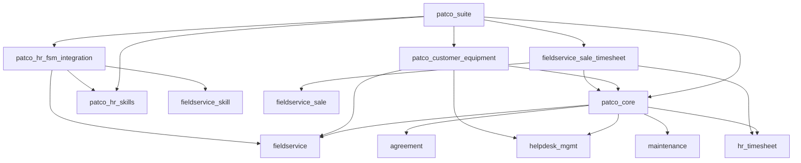
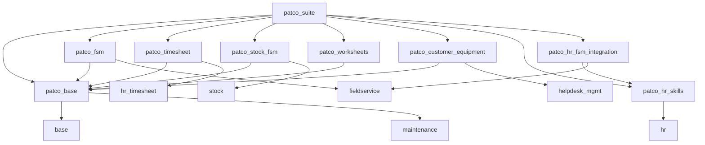

# Análisis Detallado de Dependencias - Módulos PATCO

## Matriz de Dependencias Actuales

### patco_suite (Orquestador Principal)
**Dependencias Directas:**
```python
'depends': [
    # Módulos base de Odoo
    'base',
    'sale_management',
    'account',
    'hr',
    'hr_skills',
    'maintenance',
    'contacts',
    
    # Módulos PATCO - HR Skills (después de hr_skills)
    'patco_hr_skills',
    
    # Módulos OCA - Field Service (después de patco_hr_skills)
    'fieldservice',
    'fieldservice_account',
    'fieldservice_sale',
    'fieldservice_skill',
    'fieldservice_stock',
    'fieldservice_sale_timesheet',
    
    # Módulos OCA - Otros
    'agreement',
    'helpdesk_mgmt',
    'maintenance_equipment_category_hierarchy',
    
    # Módulos PATCO restantes
    'patco_core',
    'patco_customer_equipment',
    'patco_hr_fsm_integration',
],
```
**Total Dependencias:** 19 módulos
**Problema:** Orquestador demasiado específico, debería ser más genérico

### patco_core (Módulo Sobrecargado)
**Dependencias Directas:**
```python
'depends': [
    # --- Odoo Standard Apps ---
    'base',
    'sale_management',
    'maintenance',
    'product',
    'stock',
    'uom',
    'hr_timesheet',

    # --- OCA Agreement Management ---
    'agreement',
    'agreement_sale',

    # --- OCA Maintenance ---
    'maintenance_equipment_category_hierarchy',

    # --- OCA Field Service ---
    'fieldservice',
    'helpdesk_mgmt',
    'helpdesk_mgmt_sale',
    'fieldservice_account',
    'fieldservice_stock',
    'fieldservice_sale',
    'web_responsive',
    'contacts',
],
```
**Total Dependencias:** 19 módulos
**Problema Crítico:** Demasiadas dependencias para un solo módulo

### patco_customer_equipment (Bien Estructurado)
**Dependencias Directas:**
```python
'depends': [
    'base',
    'mail',
    'maintenance',
    'maintenance_equipment_category_hierarchy',
    'patco_core',  # DEPENDENCIA PROBLEMÁTICA
    'fieldservice',
    'helpdesk_mgmt',
    'helpdesk_mgmt_sale',
],
```
**Total Dependencias:** 8 módulos
**Problema:** Dependencia de patco_core sobrecargado

### patco_hr_fsm_integration (Específico)
**Dependencias Directas:**
```python
'depends': [
    'hr',
    'fieldservice',
    'fieldservice_skill',
    'patco_hr_skills',
],
```
**Total Dependencias:** 4 módulos
**Estado:** ✅ Dependencias apropiadas y específicas

### patco_hr_skills (Independiente)
**Dependencias Directas:**
```python
'depends': [
    'hr',
],
```
**Total Dependencias:** 1 módulo
**Estado:** ✅ Muy bien estructurado, mínimas dependencias
**Problema:** Falta integración con fieldservice_skill

### fieldservice_sale_timesheet (Puente)
**Dependencias Directas:**
```python
'depends': [
    'fieldservice_sale',
    'hr_timesheet',
    'patco_core',  # DEPENDENCIA PROBLEMÁTICA
],
```
**Total Dependencias:** 3 módulos
**Problema:** Dependencia innecesaria de patco_core

## Análisis de Problemas de Dependencias

### 1. Dependencia Central Problemática: patco_core

**Módulos que dependen de patco_core:**
- patco_suite ➜ patco_core
- patco_customer_equipment ➜ patco_core
- fieldservice_sale_timesheet ➜ patco_core

**Problema:** patco_core actúa como "god module" con demasiadas responsabilidades

**Impacto:**
- Imposible instalar módulos independientemente
- Cambios en patco_core afectan a todos los módulos
- Dificulta el mantenimiento y testing
- Viola principio de responsabilidad única

### 2. Cadena de Dependencias Compleja



### 3. Dependencias Redundantes

**Módulos con dependencias duplicadas:**
- `fieldservice`: patco_suite, patco_core, patco_customer_equipment, patco_hr_fsm_integration
- `helpdesk_mgmt`: patco_suite, patco_core, patco_customer_equipment
- `maintenance`: patco_suite, patco_core, patco_customer_equipment

**Problema:** Dependencias se declaran múltiples veces innecesariamente

## Arquitectura Objetivo de Dependencias

### Principios de Diseño
1. **Dependencia hacia arriba:** Módulos específicos dependen de módulos base
2. **Evitar dependencias circulares:** Ningún módulo debe depender de sus dependientes
3. **Minimizar dependencias:** Solo dependencias esenciales
4. **Separación de responsabilidades:** Cada módulo con propósito específico

### Nueva Estructura de Dependencias



### Beneficios de la Nueva Arquitectura

1. **patco_base como fundación única:**
   - Todas las clasificaciones PATCO centralizadas
   - Dependencias mínimas y estables
   - Reutilizable por todos los módulos especializados

2. **Módulos especializados independientes:**
   - patco_fsm: Solo funcionalidades Field Service
   - patco_timesheet: Solo control de tiempo
   - patco_stock_fsm: Solo inventario en campo
   - patco_worksheets: Solo documentos digitales

3. **Dependencias claras y específicas:**
   - Cada módulo depende solo de lo que necesita
   - Eliminación de dependencias redundantes
   - Posibilidad de instalación selectiva

## Plan de Migración de Dependencias

### Fase 1: Crear patco_base
**Objetivo:** Extraer fundamentos de patco_core

**Dependencias patco_base:**
```python
'depends': [
    'base',
    'maintenance',
    # Solo dependencias esenciales para clasificaciones
],
```

**Migración:**
- Mover modelos de clasificación PATCO
- Mover datos maestros
- Mover configuraciones base

### Fase 2: Crear módulos especializados

**patco_fsm:**
```python
'depends': [
    'patco_base',
    'fieldservice',
    'fieldservice_skill',
],
```

**patco_timesheet:**
```python
'depends': [
    'patco_base',
    'hr_timesheet',
    'fieldservice',  # Para fsm_order
],
```

**patco_stock_fsm:**
```python
'depends': [
    'patco_base',
    'stock',
    'fieldservice',
],
```

**patco_worksheets:**
```python
'depends': [
    'patco_base',
    'fieldservice',
],
```

### Fase 3: Actualizar módulos existentes

**patco_customer_equipment (actualizado):**
```python
'depends': [
    'patco_base',  # Cambio de patco_core a patco_base
    'maintenance',
    'helpdesk_mgmt',
    'fieldservice',
],
```

**patco_hr_skills (mejorado):**
```python
'depends': [
    'hr',
    'fieldservice_skill',  # AÑADIR para integración
],
```

### Fase 4: Reducir patco_core

**patco_core (reducido):**
```python
'depends': [
    'patco_base',
    'patco_fsm',
    'patco_timesheet',
    'patco_stock_fsm',
    'patco_worksheets',
    # Solo orquestación, no funcionalidad directa
],
```

## Validación de Dependencias

### Tests de Dependencias
1. **Test de instalación independiente:** Cada módulo debe instalarse solo
2. **Test de dependencias circulares:** Verificar ausencia de ciclos
3. **Test de dependencias mínimas:** Verificar que no hay dependencias innecesarias
4. **Test de funcionalidad:** Verificar que la funcionalidad se preserva

### Checklist de Validación
- [ ] patco_base instalable independientemente
- [ ] Módulos especializados instalables con patco_base
- [ ] patco_customer_equipment funciona con patco_base
- [ ] patco_hr_skills integra con fieldservice_skill
- [ ] fieldservice_sale_timesheet deprecado sin impacto
- [ ] patco_suite orquesta correctamente todos los módulos

## Conclusiones del Análisis

### Problemas Críticos Identificados
1. **patco_core como bottleneck:** Todos los módulos dependen de él
2. **Dependencias excesivas:** 19 dependencias en patco_core
3. **Acoplamiento alto:** Cambios en un módulo afectan a otros
4. **Duplicación de dependencias:** Mismas dependencias declaradas múltiples veces

### Beneficios de la Refactorización
1. **Modularidad real:** Instalación selectiva de funcionalidades
2. **Mantenimiento simplificado:** Cambios localizados por dominio
3. **Testing granular:** Tests específicos por funcionalidad
4. **Escalabilidad:** Fácil añadir nuevas funcionalidades
5. **Cumplimiento OCA:** Alineación con mejores prácticas

### Riesgos Controlados
1. **Migración gradual:** Fase por fase sin interrumpir operaciones
2. **Backup completo:** Estado actual preservado
3. **Tests de regresión:** Validación continua de funcionalidad
4. **Rollback disponible:** Vuelta atrás en cualquier momento

---

**Estado:** Análisis de dependencias completado
**Próximo Paso:** Verificar funcionamiento del sistema actual
**Preparación:** Lista para iniciar Fase 1 de refactorización