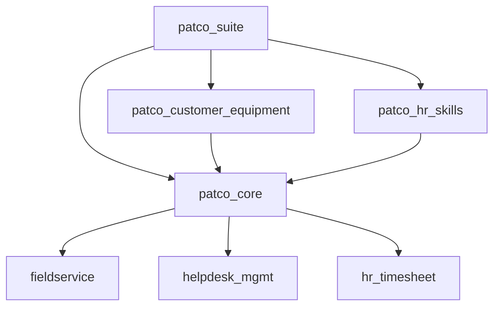

# Arquitectura PATCO Optimizada - Análisis y Hoja de Ruta

## Resumen Ejecutivo

Este documento presenta un análisis exhaustivo de la arquitectura actual de los módulos PATCO y propone una hoja de ruta para optimizar el sistema siguiendo los principios de **alta cohesión y bajo acoplamiento**. El objetivo es eliminar duplicaciones de código, mejorar la mantenibilidad y asegurar que cada funcionalidad esté ubicada en el módulo más apropiado.

## Estado Actual de la Arquitectura

### Módulos Implementados

#### 1. `patco_suite` - Orquestador Principal ✅
- **Propósito**: Meta-módulo que coordina la instalación completa
- **Estado**: Bien diseñado, cumple su función correctamente
- **Cohesión**: Alta - Se enfoca únicamente en orquestación
- **Acoplamiento**: Bajo - Solo declara dependencias, no implementa lógica

#### 2. `patco_core` - Motor Central ⚠️
- **Propósito**: Núcleo del sistema con funcionalidades base
- **Estado**: Sobrecargado, necesita refactorización
- **Problemas identificados**:
  - Mezcla responsabilidades de FSM, timesheet, stock y helpdesk
  - Contiene 89 líneas en `__manifest__.py` con muchas dependencias
  - Modelos dispersos sin clara separación de responsabilidades

#### 3. `patco_customer_equipment` - Gestión de Activos ✅
- **Propósito**: Administración especializada de equipos
- **Estado**: Bien enfocado, alta cohesión
- **Fortalezas**: Responsabilidad clara y bien delimitada

#### 4. `patco_hr_skills` - Matriz de Competencias ⚠️
- **Propósito**: Sistema de habilidades técnicas
- **Estado**: Incompleto, falta integración con FSM
- **Problemas**: No incluye `fieldservice_skill` como dependencia

#### 5. `patco_hr_fsm_integration` - Sincronización HR-FSM ✅
- **Propósito**: Integración entre HR y Field Service
- **Estado**: Bien diseñado, responsabilidad específica

#### 6. `fieldservice_sale_timesheet` - Módulo Puente ✅
- **Propósito**: Conector técnico entre módulos OCA
- **Estado**: Correcto como módulo puente

## Análisis de Problemas Arquitectónicos

### 1. Violaciones del Principio de Responsabilidad Única

#### `patco_core` - Sobrecarga de Responsabilidades
```python
# Modelos mezclados en patco_core:
- account_analytic_line.py          # Timesheet
- fsm_order.py                      # Field Service
- fsm_order_consumed_part.py        # Stock/Inventory
- fsm_worksheet.py                  # Documentos digitales
- stock_transfer_request.py         # Stock/Inventory
- timesheets_analysis_report.py     # Reporting
```

**Problema**: Un solo módulo maneja timesheet, FSM, stock, documentos y reportes.

### 2. Dependencias Circulares Potenciales



**Problema**: `patco_core` tiene demasiadas dependencias externas, creando acoplamiento alto.

### 3. Duplicación de Funcionalidades

- **Timesheet**: Lógica dispersa entre `patco_core` y `fieldservice_sale_timesheet`
- **Stock**: Funcionalidades de stock en `patco_core` que podrían estar en módulo específico
- **FSM Extensions**: Extensiones de FSM mezcladas con otras responsabilidades

## Arquitectura Propuesta - Refactorización

### Principios de Diseño

1. **Alta Cohesión**: Cada módulo debe tener una responsabilidad clara y específica
2. **Bajo Acoplamiento**: Minimizar dependencias entre módulos
3. **Separación de Responsabilidades**: Un módulo = Una funcionalidad principal
4. **Reutilización**: Funcionalidades comunes en módulos base

### Nueva Estructura Modular

#### Módulos Principales (Tier 1)

##### 1. `patco_base` - Fundación del Sistema
```python
# Responsabilidades:
- Modelos de clasificación PATCO (nature, area, complexity)
- Configuraciones base y datos maestros
- Grupos de seguridad y permisos base
- Utilidades comunes

# Dependencias mínimas:
'depends': ['base', 'maintenance']
```

##### 2. `patco_fsm` - Extensiones Field Service
```python
# Responsabilidades:
- Extensiones de fsm.order
- Clasificación PATCO en órdenes
- Integración con helpdesk
- Flujos de trabajo FSM específicos

# Dependencias:
'depends': ['patco_base', 'fieldservice', 'helpdesk_mgmt']
```

##### 3. `patco_timesheet` - Gestión de Tiempo
```python
# Responsabilidades:
- Extensiones de account.analytic.line
- Timer de técnicos
- Análisis de rentabilidad
- Reportes de tiempo

# Dependencias:
'depends': ['patco_base', 'hr_timesheet']
```

##### 4. `patco_stock_fsm` - Inventario en Campo
```python
# Responsabilidades:
- Gestión de stock en vehículos
- Consumo de repuestos en FSM
- Transferencias de stock
- Ubicaciones móviles

# Dependencias:
'depends': ['patco_base', 'patco_fsm', 'fieldservice_stock']
```

##### 5. `patco_worksheets` - Documentos Digitales
```python
# Responsabilidades:
- Hojas de trabajo digitales
- Firmas electrónicas
- Plantillas de checklist
- Generación de PDFs

# Dependencias:
'depends': ['patco_base', 'patco_fsm']
```

#### Módulos Especializados (Tier 2)

##### 6. `patco_customer_equipment` - Gestión de Activos ✅
```python
# Mantener como está - Bien diseñado
'depends': ['patco_base', 'patco_fsm']
```

##### 7. `patco_hr_skills` - Habilidades Técnicas (Refactorizado)
```python
# Responsabilidades mejoradas:
- Habilidades HORECA específicas
- Integración con fieldservice_skill
- Matriz de competencias
- Asignación automática de técnicos

# Dependencias corregidas:
'depends': ['patco_base', 'hr_skills', 'fieldservice_skill']
```

##### 8. `patco_hr_fsm_integration` - Sincronización HR-FSM ✅
```python
# Mantener como está - Bien diseñado
'depends': ['patco_base', 'patco_hr_skills', 'patco_fsm']
```

#### Módulos de Integración (Tier 3)

##### 9. `patco_agreements` - Gestión de Contratos
```python
# Responsabilidades:
- Extensiones de agreement
- Plantillas de contratos HORECA
- Vinculación con equipos y servicios
- Facturación por contratos

# Dependencias:
'depends': ['patco_base', 'agreement', 'agreement_sale']
```

##### 10. `patco_reporting` - Reportes y Analytics
```python
# Responsabilidades:
- Dashboards ejecutivos
- KPIs de mantenimiento
- Análisis de rentabilidad
- Reportes regulatorios

# Dependencias:
'depends': ['patco_base', 'patco_fsm', 'patco_timesheet']
```

##### 11. `patco_suite` - Orquestador (Refactorizado)
```python
# Responsabilidades:
- Instalación coordinada de todos los módulos
- Configuración inicial guiada
- Validación de integridad del sistema
- Asistentes de configuración

# Dependencias:
'depends': [
    'patco_base', 'patco_fsm', 'patco_timesheet',
    'patco_stock_fsm', 'patco_worksheets',
    'patco_customer_equipment', 'patco_hr_skills',
    'patco_hr_fsm_integration', 'patco_agreements',
    'patco_reporting'
]
```

## Matriz de Dependencias Optimizada

| Módulo | Tier | Dependencias Internas | Dependencias OCA/Core |
|--------|------|----------------------|----------------------|
| patco_base | 1 | - | base, maintenance |
| patco_fsm | 1 | patco_base | fieldservice, helpdesk_mgmt |
| patco_timesheet | 1 | patco_base | hr_timesheet |
| patco_stock_fsm | 1 | patco_base, patco_fsm | fieldservice_stock |
| patco_worksheets | 1 | patco_base, patco_fsm | - |
| patco_customer_equipment | 2 | patco_base, patco_fsm | maintenance_equipment_category_hierarchy |
| patco_hr_skills | 2 | patco_base | hr_skills, fieldservice_skill |
| patco_hr_fsm_integration | 2 | patco_base, patco_hr_skills, patco_fsm | - |
| patco_agreements | 3 | patco_base | agreement, agreement_sale |
| patco_reporting | 3 | patco_base, patco_fsm, patco_timesheet | - |
| patco_suite | 3 | Todos los anteriores | - |

## Plan de Migración

### Fase 1: Preparación y Análisis (Semana 1)

#### Tareas:
1. **Backup completo** del sistema actual
2. **Análisis detallado** de dependencias de código
3. **Mapeo de funcionalidades** por módulo actual
4. **Identificación de puntos de ruptura** potenciales

#### Entregables:
- Inventario completo de funcionalidades
- Matriz de dependencias actual
- Plan detallado de refactorización

### Fase 2: Creación de Módulos Base (Semana 2)

#### Tareas:
1. **Crear `patco_base`**:
   - Migrar modelos de clasificación desde `patco_core`
   - Mover datos maestros (nature, area, complexity)
   - Establecer grupos de seguridad base

2. **Refactorizar `patco_hr_skills`**:
   - Añadir dependencia `fieldservice_skill`
   - Completar integración con FSM
   - Migrar datos de habilidades

#### Código de Ejemplo - `patco_base/__manifest__.py`:
```python
{
    'name': 'PATCO Base',
    'version': '18.0.1.0.0',
    'category': 'Technical/Base',
    'summary': 'Módulo base con configuraciones fundamentales de PATCO',
    'depends': [
        'base',
        'maintenance',
        'maintenance_equipment_category_hierarchy',
    ],
    'data': [
        'security/patco_security.xml',
        'security/ir.model.access.csv',
        'data/patco_service_nature_data.xml',
        'data/patco_service_area_data.xml',
        'data/patco_service_complexity_data.xml',
        'data/maintenance_equipment_category_data.xml',
    ],
    'installable': True,
    'application': False,
}
```

### Fase 3: Separación de Responsabilidades (Semana 3-4)

#### Tareas:
1. **Crear `patco_fsm`**:
   - Migrar extensiones de `fsm.order` desde `patco_core`
   - Mover vistas FSM específicas
   - Establecer integración con helpdesk

2. **Crear `patco_timesheet`**:
   - Migrar extensiones de `account.analytic.line`
   - Mover funcionalidades de timer
   - Separar reportes de tiempo

3. **Crear `patco_stock_fsm`**:
   - Migrar gestión de stock en vehículos
   - Mover modelos de consumo de repuestos
   - Establecer ubicaciones móviles

4. **Crear `patco_worksheets`**:
   - Migrar sistema de hojas de trabajo digitales
   - Mover wizards de firma y aprobación
   - Separar plantillas de checklist

### Fase 4: Integración y Validación (Semana 5)

#### Tareas:
1. **Actualizar dependencias** en módulos existentes
2. **Crear `patco_agreements`** y `patco_reporting`
3. **Refactorizar `patco_suite`** como orquestador
4. **Pruebas integrales** del sistema refactorizado

### Fase 5: Optimización y Documentación (Semana 6)

#### Tareas:
1. **Optimización de rendimiento**
2. **Actualización de documentación**
3. **Capacitación del equipo**
4. **Despliegue en producción**

## Beneficios de la Refactorización

### 1. Mantenibilidad Mejorada
- **Código más limpio**: Cada módulo tiene una responsabilidad clara
- **Debugging simplificado**: Errores localizados en módulos específicos
- **Actualizaciones seguras**: Cambios aislados por funcionalidad

### 2. Escalabilidad
- **Módulos independientes**: Posibilidad de instalar solo funcionalidades necesarias
- **Desarrollo paralelo**: Equipos pueden trabajar en módulos diferentes
- **Extensibilidad**: Fácil añadir nuevas funcionalidades

### 3. Reutilización
- **Componentes modulares**: Reutilización en otros proyectos
- **APIs claras**: Interfaces bien definidas entre módulos
- **Configuración flexible**: Adaptación a diferentes necesidades

### 4. Cumplimiento de Estándares
- **Principios SOLID**: Especialmente SRP (Single Responsibility Principle)
- **Patrones de diseño**: Implementación de patrones reconocidos
- **Mejores prácticas Odoo**: Seguimiento de convenciones oficiales

## Consideraciones de Implementación

### 1. Compatibilidad hacia Atrás
- **Migración de datos**: Scripts automáticos para migrar configuraciones
- **Aliases de compatibilidad**: Mantener referencias temporales
- **Documentación de cambios**: Guías de migración detalladas

### 2. Testing
- **Pruebas unitarias**: Por cada módulo refactorizado
- **Pruebas de integración**: Entre módulos relacionados
- **Pruebas de regresión**: Validar que funcionalidades existentes siguen funcionando

### 3. Despliegue
- **Estrategia blue-green**: Despliegue sin downtime
- **Rollback plan**: Plan de reversión en caso de problemas
- **Monitoreo**: Supervisión post-despliegue

## Conclusiones

La refactorización propuesta transformará la arquitectura PATCO de un sistema monolítico con alta cohesión interna pero responsabilidades mezcladas, a un sistema modular con:

- **Alta cohesión** dentro de cada módulo
- **Bajo acoplamiento** entre módulos
- **Separación clara** de responsabilidades
- **Escalabilidad** y **mantenibilidad** mejoradas

Esta arquitectura optimizada no solo resolverá los problemas actuales de duplicación de código y responsabilidades mezcladas, sino que también proporcionará una base sólida para el crecimiento futuro del sistema PATCO.

## Próximos Pasos

1. **Aprobación** del plan de refactorización
2. **Asignación de recursos** para la implementación
3. **Inicio de Fase 1**: Preparación y análisis detallado
4. **Establecimiento de métricas** de éxito
5. **Comunicación** del plan al equipo de desarrollo

---

*Documento generado siguiendo las reglas del proyecto y los principios de alta cohesión y bajo acoplamiento establecidos en `project_rules.md`*