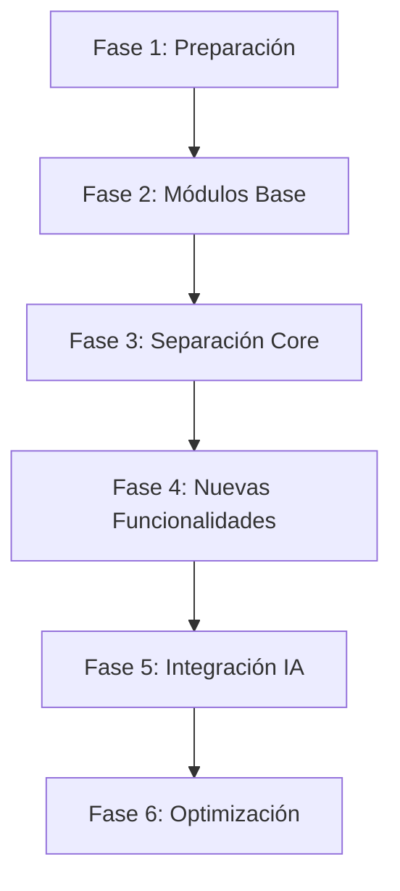

# Hoja de Ruta de Implementación PATCO - Del Estado Actual al Objetivo Funcional

## Resumen Ejecutivo

Este documento presenta una hoja de ruta detallada para transformar la arquitectura actual de los módulos PATCO hacia el sistema objetivo descrito en el documento funcional. La implementación se estructura en 6 fases progresivas que abordan tanto la refactorización arquitectónica como la implementación de nuevas funcionalidades, siguiendo los principios de alta cohesión y bajo acoplamiento.

## Análisis de Brecha: Estado Actual vs. Objetivo

### Funcionalidades Implementadas ✅

| Funcionalidad | Módulo Actual | Estado | Observaciones |
|---------------|---------------|--------|--------------|
| Clasificación PATCO | `patco_core` | ✅ Completo | Modelos nature, area, complexity implementados |
| Gestión de Activos | `patco_customer_equipment` | ✅ Completo | Códigos QR, campos personalizados |
| Habilidades Técnicas | `patco_hr_skills` | ⚠️ Parcial | Falta integración con fieldservice_skill |
| Sincronización HR-FSM | `patco_hr_fsm_integration` | ✅ Completo | Bidireccional y automática |
| Extensiones FSM | `patco_core` | ✅ Completo | fsm.order extendido con clasificación |
| Hojas de Trabajo | `patco_core` | ✅ Completo | Sistema digital con firmas |
| Control de Tiempo | `patco_core` | ✅ Completo | Timer integrado |
| Stock en Vehículos | `patco_core` | ✅ Completo | Ubicaciones por furgoneta |

### Funcionalidades Faltantes ❌

| Funcionalidad | Prioridad | Complejidad | Módulo Objetivo |
|---------------|-----------|-------------|----------------|
| Gestión de Acuerdos | Alta | Media | `patco_agreements` |
| Base de Conocimiento | Alta | Alta | `patco_worksheets` |
| Checklists por Categoría | Alta | Baja | `patco_worksheets` |
| Asistente IA Telegram | Media | Alta | Sistema externo + API |
| Reportes Ejecutivos | Media | Media | `patco_reporting` |
| Automatizaciones | Baja | Media | Varios módulos |

### Problemas Arquitectónicos Críticos ⚠️

1. **`patco_core` Sobrecargado**: 89 líneas en manifest, responsabilidades mezcladas
2. **Dependencias Circulares**: Alto acoplamiento entre módulos
3. **Duplicación de Código**: Lógica dispersa entre módulos
4. **Falta de Separación**: Timesheet, FSM, Stock en un solo módulo

## Estrategia de Implementación

### Principios Rectores

1. **Migración Incremental**: Sin interrumpir operaciones actuales
2. **Compatibilidad hacia Atrás**: Mantener funcionalidades existentes
3. **Validación Continua**: Testing en cada fase
4. **Documentación Viva**: Actualización constante de documentación

### Enfoque de Refactorización



## Fase 1: Preparación y Análisis (Semanas 1-2)

### Objetivos
- Establecer base sólida para refactorización
- Completar análisis de dependencias
- Preparar entorno de desarrollo

### Tareas Críticas

#### 1.1 Análisis de Código Existente
```bash
# Análisis de dependencias
grep -r "from.*patco" extra-addons/
grep -r "import.*patco" extra-addons/

# Mapeo de funcionalidades
find extra-addons/patco_* -name "*.py" -exec wc -l {} +
```

#### 1.2 Backup y Versionado
- Crear branch `refactoring/architecture-v2`
- Backup completo de base de datos
- Documentar estado actual de datos

#### 1.3 Configuración de Testing
```python
# tests/test_migration_compatibility.py
class TestMigrationCompatibility(TransactionCase):
    def test_existing_fsm_orders_intact(self):
        """Verificar que órdenes existentes siguen funcionando"""
        pass
    
    def test_patco_classification_preserved(self):
        """Verificar que clasificación PATCO se mantiene"""
        pass
```

### Entregables Fase 1
- [ ] Inventario completo de funcionalidades
- [ ] Matriz de dependencias detallada
- [ ] Plan de migración de datos
- [ ] Suite de tests de compatibilidad
- [ ] Entorno de desarrollo configurado

## Fase 2: Creación de Módulos Base (Semanas 3-4)

### Objetivos
- Crear fundación modular sólida
- Establecer separación clara de responsabilidades
- Migrar funcionalidades base sin romper sistema actual

### 2.1 Crear `patco_base` - Fundación del Sistema

#### Estructura del Módulo
```
patco_base/
├── __manifest__.py
├── models/
│   ├── __init__.py
│   ├── patco_service_nature.py
│   ├── patco_service_area.py
│   ├── patco_service_complexity.py
│   └── maintenance_equipment_category.py
├── data/
│   ├── patco_service_nature_data.xml
│   ├── patco_service_area_data.xml
│   ├── patco_service_complexity_data.xml
│   └── maintenance_equipment_category_data.xml
├── security/
│   ├── patco_security.xml
│   └── ir.model.access.csv
└── views/
    └── patco_base_views.xml
```

#### Manifest Optimizado
```python
# patco_base/__manifest__.py
{
    'name': 'PATCO Base',
    'version': '18.0.1.0.0',
    'category': 'Technical/Base',
    'summary': 'Módulo base con configuraciones fundamentales de PATCO',
    'description': '''
        Módulo fundacional que contiene:
        - Modelos de clasificación PATCO (nature, area, complexity)
        - Configuraciones base y datos maestros
        - Grupos de seguridad y permisos base
        - Utilidades comunes del sistema PATCO
    ''',
    'depends': [
        'base',
        'maintenance',
        'maintenance_equipment_category_hierarchy',
    ],
    'data': [
        'security/patco_security.xml',
        'security/ir.model.access.csv',
        'data/patco_service_nature_data.xml',
        'data/patco_service_area_data.xml',
        'data/patco_service_complexity_data.xml',
        'data/maintenance_equipment_category_data.xml',
        'views/patco_base_views.xml',
    ],
    'installable': True,
    'application': False,
    'auto_install': False,
}
```

#### Migración de Modelos Base
```python
# patco_base/models/patco_service_nature.py
from odoo import models, fields, api

class PatcoServiceNature(models.Model):
    _name = 'patco.service.nature'
    _description = 'Naturaleza del Servicio PATCO'
    _order = 'sequence, name'
    
    name = fields.Char('Nombre', required=True)
    code = fields.Char('Código', required=True, size=10)
    description = fields.Text('Descripción')
    sequence = fields.Integer('Secuencia', default=10)
    active = fields.Boolean('Activo', default=True)
    
    _sql_constraints = [
        ('code_unique', 'unique(code)', 'El código debe ser único'),
    ]
```

### 2.2 Refactorizar `patco_hr_skills`

#### Corrección de Dependencias
```python
# patco_hr_skills/__manifest__.py (actualizado)
{
    'depends': [
        'patco_base',  # Nueva dependencia
        'hr_skills',
        'fieldservice_skill',  # Dependencia faltante añadida
        'hr',
    ],
}
```

#### Integración con Field Service
```python
# patco_hr_skills/models/hr_employee.py
class HrEmployee(models.Model):
    _inherit = 'hr.employee'
    
    fieldservice_skill_ids = fields.One2many(
        'fieldservice.worker.skill',
        'worker_id',
        string='Habilidades de Campo',
        help='Habilidades específicas para servicios de campo'
    )
    
    @api.model
    def sync_skills_to_fieldservice(self):
        """Sincronizar habilidades HR con Field Service"""
        for employee in self.search([('is_fsm_worker', '=', True)]):
            # Lógica de sincronización
            pass
```

### Entregables Fase 2
- [ ] `patco_base` funcional y probado
- [ ] `patco_hr_skills` refactorizado con integración FSM
- [ ] Scripts de migración de datos
- [ ] Tests de integración
- [ ] Documentación de APIs

## Fase 3: Separación de Responsabilidades (Semanas 5-8)

### Objetivos
- Descomponer `patco_core` en módulos especializados
- Eliminar duplicación de código
- Establecer interfaces claras entre módulos

### 3.1 Crear `patco_fsm` - Extensiones Field Service

#### Migración desde `patco_core`
```python
# Archivos a migrar:
# patco_core/models/fsm_order.py -> patco_fsm/models/fsm_order.py
# patco_core/views/fsm_order_views.xml -> patco_fsm/views/fsm_order_views.xml
```

#### Estructura Optimizada
```python
# patco_fsm/models/fsm_order.py
class FSMOrder(models.Model):
    _inherit = 'fsm.order'
    
    # Clasificación PATCO
    x_nature_id = fields.Many2one('patco.service.nature')
    x_area_id = fields.Many2one('patco.service.area')
    x_complexity_id = fields.Many2one('patco.service.complexity')
    
    # Campos calculados
    x_patco_code = fields.Char(compute='_compute_patco_code')
    
    @api.depends('x_nature_id', 'x_area_id', 'x_complexity_id')
    def _compute_patco_code(self):
        for record in self:
            # Lógica de cálculo movida desde patco_core
            pass
```

### 3.2 Crear `patco_timesheet` - Gestión de Tiempo

#### Separación de Responsabilidades
```python
# patco_timesheet/models/account_analytic_line.py
class AccountAnalyticLine(models.Model):
    _inherit = 'account.analytic.line'
    
    # Timer específico para FSM
    fsm_timer_start = fields.Datetime('Inicio Timer FSM')
    fsm_timer_duration = fields.Float('Duración Timer')
    
    def start_fsm_timer(self):
        """Iniciar timer específico para FSM"""
        self.fsm_timer_start = fields.Datetime.now()
    
    def stop_fsm_timer(self):
        """Detener timer y calcular duración"""
        if self.fsm_timer_start:
            duration = fields.Datetime.now() - self.fsm_timer_start
            self.unit_amount = duration.total_seconds() / 3600
```

### 3.3 Crear `patco_stock_fsm` - Inventario en Campo

#### Gestión Especializada de Stock
```python
# patco_stock_fsm/models/fsm_order_consumed_part.py
class FSMOrderConsumedPart(models.Model):
    _name = 'fsm.order.consumed.part'
    _description = 'Repuestos Consumidos en FSM'
    
    fsm_order_id = fields.Many2one('fsm.order', required=True)
    product_id = fields.Many2one('product.product', required=True)
    quantity = fields.Float('Cantidad', default=1.0)
    location_id = fields.Many2one('stock.location', 'Ubicación Origen')
    
    @api.model_create_multi
    def create(self, vals_list):
        """Crear movimiento de stock automáticamente"""
        records = super().create(vals_list)
        for record in records:
            record._create_stock_move()
        return records
```

### 3.4 Crear `patco_worksheets` - Documentos Digitales

#### Sistema de Hojas de Trabajo Mejorado
```python
# patco_worksheets/models/fsm_worksheet.py
class FSMWorksheet(models.Model):
    _name = 'fsm.worksheet'
    _description = 'Hoja de Trabajo Digital FSM'
    
    # Campos base
    name = fields.Char('Nombre', required=True)
    fsm_order_id = fields.Many2one('fsm.order', required=True)
    template_id = fields.Many2one('fsm.worksheet.template')
    
    # Checklists dinámicos
    entry_checklist = fields.Html('Checklist Entrada')
    exit_checklist = fields.Html('Checklist Salida')
    
    # Base de conocimiento
    knowledge_base_files = fields.One2many(
        related='fsm_order_id.equipment_id.category_id.attachment_ids'
    )
```

### Entregables Fase 3
- [ ] `patco_fsm` con funcionalidades FSM migradas
- [ ] `patco_timesheet` con gestión de tiempo separada
- [ ] `patco_stock_fsm` con inventario especializado
- [ ] `patco_worksheets` con sistema mejorado
- [ ] `patco_core` reducido y enfocado
- [ ] Tests de migración completos

## Fase 4: Nuevas Funcionalidades Críticas (Semanas 9-12)

### Objetivos
- Implementar funcionalidades faltantes del documento funcional
- Establecer base para integración con IA
- Completar flujos de negocio principales

### 4.1 Implementar `patco_agreements` - Gestión de Contratos

#### Integración con OCA Agreement
```python
# patco_agreements/__manifest__.py
{
    'name': 'PATCO Agreements',
    'depends': [
        'patco_base',
        'agreement',
        'agreement_sale',
        'sale',
    ],
}
```

#### Extensiones Específicas HORECA
```python
# patco_agreements/models/agreement.py
class Agreement(models.Model):
    _inherit = 'agreement.agreement'
    
    # Clasificación PATCO para contratos
    patco_service_types = fields.Many2many(
        'patco.service.nature',
        string='Tipos de Servicio Incluidos'
    )
    
    # Equipos cubiertos
    covered_equipment_ids = fields.Many2many(
        'maintenance.equipment',
        string='Equipos Cubiertos'
    )
    
    # Métricas del contrato
    total_fsm_orders = fields.Integer(
        compute='_compute_fsm_metrics',
        string='Total Órdenes FSM'
    )
    
    @api.depends('partner_id')
    def _compute_fsm_metrics(self):
        for agreement in self:
            # Calcular métricas desde fsm.order
            pass
```

### 4.2 Mejorar Base de Conocimiento

#### Checklists por Categoría
```python
# patco_worksheets/models/maintenance_equipment_category.py
class MaintenanceEquipmentCategory(models.Model):
    _inherit = 'maintenance.equipment.category'
    
    # Plantillas de checklist
    entry_checklist_template = fields.Html(
        'Plantilla Checklist Entrada',
        help='Procedimientos estándar para diagnóstico inicial'
    )
    
    exit_checklist_template = fields.Html(
        'Plantilla Checklist Salida',
        help='Verificaciones finales antes de cerrar servicio'
    )
    
    # Base de conocimiento
    knowledge_base_description = fields.Html(
        'Descripción Base de Conocimiento'
    )
```

#### Herencia Automática en FSM
```python
# patco_fsm/models/fsm_order.py (extensión)
class FSMOrder(models.Model):
    _inherit = 'fsm.order'
    
    # Checklists heredados
    entry_checklist = fields.Html(
        related='equipment_id.category_id.entry_checklist_template',
        string='Checklist de Entrada'
    )
    
    exit_checklist = fields.Html(
        related='equipment_id.category_id.exit_checklist_template',
        string='Checklist de Salida'
    )
    
    # Documentación técnica
    knowledge_base_files = fields.One2many(
        related='equipment_id.category_id.attachment_ids',
        string='Base de Conocimiento'
    )
```

### 4.3 Automatizaciones Críticas

#### Flujo Helpdesk -> FSM
```python
# patco_fsm/models/helpdesk_ticket.py
class HelpdeskTicket(models.Model):
    _inherit = 'helpdesk.ticket'
    
    # Clasificación PATCO en tickets
    x_nature_id = fields.Many2one('patco.service.nature')
    x_area_id = fields.Many2one('patco.service.area')
    x_complexity_id = fields.Many2one('patco.service.complexity')
    
    def action_create_fsm_order(self):
        """Crear FSM Order desde ticket con clasificación heredada"""
        fsm_order = self.env['fsm.order'].create({
            'name': f'FSM-{self.name}',
            'partner_id': self.partner_id.id,
            'equipment_id': self.equipment_id.id,
            'x_nature_id': self.x_nature_id.id,
            'x_area_id': self.x_area_id.id,
            'x_complexity_id': self.x_complexity_id.id,
            'ticket_id': self.id,
        })
        return fsm_order
```

### Entregables Fase 4
- [ ] `patco_agreements` funcional con OCA
- [ ] Base de conocimiento por categoría implementada
- [ ] Checklists automáticos en FSM
- [ ] Automatizaciones Helpdesk->FSM
- [ ] Flujos de negocio completos
- [ ] Documentación de usuario

## Fase 5: Integración con IA (Semanas 13-16)

### Objetivos
- Preparar infraestructura para Asistente IA
- Implementar APIs necesarias
- Crear base para integración Telegram

### 5.1 Preparación de APIs

#### Endpoint para Asistente IA
```python
# patco_ai_integration/controllers/ai_webhook.py
from odoo import http
from odoo.http import request
import json

class AIWebhookController(http.Controller):
    
    @http.route('/api/fsm/assignment', type='json', auth='api_key', methods=['POST'])
    def fsm_assignment_webhook(self, **kwargs):
        """Webhook para notificar asignación FSM al Asistente IA"""
        data = request.jsonrequest
        fsm_order = request.env['fsm.order'].browse(data.get('fsm_order_id'))
        
        payload = {
            'fsm_order_id': fsm_order.id,
            'customer_name': fsm_order.partner_id.name,
            'technician_telegram_id': fsm_order.person_id.telegram_id,
            'assets': [{
                'asset_id': fsm_order.equipment_id.id,
                'asset_name': fsm_order.equipment_id.name,
                'entry_checklist': fsm_order.entry_checklist,
                'exit_checklist': fsm_order.exit_checklist,
                'knowledge_base_urls': [
                    f'/web/content/{att.id}' 
                    for att in fsm_order.knowledge_base_files
                ]
            }]
        }
        
        return {'status': 'success', 'payload': payload}
```

#### Campos para Integración IA
```python
# patco_ai_integration/models/hr_employee.py
class HrEmployee(models.Model):
    _inherit = 'hr.employee'
    
    telegram_id = fields.Char(
        'ID de Telegram',
        help='ID único del usuario en Telegram para el Asistente IA'
    )
    
    ai_assistant_active = fields.Boolean(
        'Asistente IA Activo',
        default=False,
        help='Indica si el técnico usa el Asistente IA'
    )
```

```python
# patco_ai_integration/models/fsm_order.py
class FSMOrder(models.Model):
    _inherit = 'fsm.order'
    
    ai_report_url = fields.Char(
        'Enlace Informe IA',
        help='URL del informe generado por el Asistente IA'
    )
    
    ai_conversation_id = fields.Char(
        'ID Conversación IA',
        help='Identificador de la conversación en Telegram'
    )
    
    ai_status = fields.Selection([
        ('pending', 'Pendiente'),
        ('in_progress', 'En Progreso'),
        ('completed', 'Completado'),
        ('error', 'Error')
    ], string='Estado IA', default='pending')
```

### 5.2 Automatización de Notificaciones

#### Acción Automatizada para Asignación
```xml
<!-- patco_ai_integration/data/ir_actions_server.xml -->
<record id="action_notify_ai_assignment" model="ir.actions.server">
    <field name="name">Notificar Asignación a IA</field>
    <field name="model_id" ref="fieldservice.model_fsm_order"/>
    <field name="state">code</field>
    <field name="code">
if record.person_id and record.person_id.ai_assistant_active:
    # Llamar webhook del Asistente IA
    import requests
    import json
    
    payload = {
        'fsm_order_id': record.id,
        'technician_telegram_id': record.person_id.telegram_id,
        # ... resto del payload
    }
    
    try:
        response = requests.post(
            'https://ai-assistant.patco.com/webhook/fsm-assignment',
            json=payload,
            timeout=10
        )
        if response.status_code == 200:
            record.ai_status = 'in_progress'
    except Exception as e:
        record.ai_status = 'error'
    </field>
</record>
```

### 5.3 Preparación para pgvector

#### Configuración Base de Conocimiento Vectorial
```python
# patco_ai_integration/models/knowledge_base.py
class KnowledgeBaseVector(models.Model):
    _name = 'patco.knowledge.vector'
    _description = 'Base de Conocimiento Vectorizada'
    
    attachment_id = fields.Many2one('ir.attachment', required=True)
    equipment_category_id = fields.Many2one('maintenance.equipment.category')
    content_chunk = fields.Text('Fragmento de Contenido')
    embedding_vector = fields.Text('Vector de Embedding')
    chunk_index = fields.Integer('Índice del Fragmento')
    
    @api.model
    def create_embeddings_for_attachment(self, attachment_id):
        """Crear embeddings para un archivo adjunto"""
        # Lógica para procesar archivo y crear vectores
        pass
```

### Entregables Fase 5
- [ ] APIs REST para integración IA
- [ ] Campos de integración en modelos
- [ ] Automatizaciones de notificación
- [ ] Base para pgvector
- [ ] Documentación de APIs
- [ ] Tests de integración

## Fase 6: Optimización y Reporting (Semanas 17-20)

### Objetivos
- Crear módulo de reportes ejecutivos
- Optimizar rendimiento del sistema
- Completar documentación
- Preparar para producción

### 6.1 Crear `patco_reporting` - Analytics y KPIs

#### Dashboard Ejecutivo
```python
# patco_reporting/models/fsm_analytics.py
class FSMAnalytics(models.Model):
    _name = 'patco.fsm.analytics'
    _description = 'Analytics de Field Service PATCO'
    _auto = False
    
    # Dimensiones
    date = fields.Date('Fecha')
    technician_id = fields.Many2one('hr.employee', 'Técnico')
    customer_id = fields.Many2one('res.partner', 'Cliente')
    nature_id = fields.Many2one('patco.service.nature', 'Naturaleza')
    area_id = fields.Many2one('patco.service.area', 'Área')
    complexity_id = fields.Many2one('patco.service.complexity', 'Complejidad')
    
    # Métricas
    total_orders = fields.Integer('Total Órdenes')
    completed_orders = fields.Integer('Órdenes Completadas')
    avg_duration = fields.Float('Duración Promedio (hrs)')
    first_time_fix_rate = fields.Float('Tasa Resolución Primera Visita')
    customer_satisfaction = fields.Float('Satisfacción Cliente')
    
    def init(self):
        tools.drop_view_if_exists(self.env.cr, self._table)
        self.env.cr.execute("""
            CREATE OR REPLACE VIEW %s AS (
                SELECT 
                    row_number() OVER () AS id,
                    DATE(fo.create_date) as date,
                    fo.person_id as technician_id,
                    fo.partner_id as customer_id,
                    fo.x_nature_id as nature_id,
                    fo.x_area_id as area_id,
                    fo.x_complexity_id as complexity_id,
                    COUNT(*) as total_orders,
                    COUNT(CASE WHEN fo.stage_id IN (SELECT id FROM fsm_stage WHERE is_closed = true) THEN 1 END) as completed_orders,
                    AVG(EXTRACT(EPOCH FROM (fo.date_end - fo.date_start))/3600) as avg_duration
                FROM fsm_order fo
                WHERE fo.create_date >= CURRENT_DATE - INTERVAL '1 year'
                GROUP BY 
                    DATE(fo.create_date),
                    fo.person_id,
                    fo.partner_id,
                    fo.x_nature_id,
                    fo.x_area_id,
                    fo.x_complexity_id
            )
        """ % self._table)
```

#### Reportes Específicos HORECA
```python
# patco_reporting/reports/equipment_performance_report.py
class EquipmentPerformanceReport(models.AbstractModel):
    _name = 'report.patco_reporting.equipment_performance'
    _description = 'Reporte de Rendimiento de Equipos'
    
    @api.model
    def _get_report_values(self, docids, data=None):
        equipment_ids = self.env['maintenance.equipment'].browse(docids)
        
        report_data = []
        for equipment in equipment_ids:
            # Calcular métricas por equipo
            fsm_orders = self.env['fsm.order'].search([
                ('equipment_id', '=', equipment.id)
            ])
            
            mtbf = self._calculate_mtbf(fsm_orders)
            mttr = self._calculate_mttr(fsm_orders)
            
            report_data.append({
                'equipment': equipment,
                'total_services': len(fsm_orders),
                'mtbf': mtbf,
                'mttr': mttr,
                'last_service': fsm_orders[0].date_end if fsm_orders else None,
            })
        
        return {
            'doc_ids': docids,
            'doc_model': 'maintenance.equipment',
            'docs': equipment_ids,
            'report_data': report_data,
        }
```

### 6.2 Optimizaciones de Rendimiento

#### Índices de Base de Datos
```sql
-- Índices para mejorar rendimiento de consultas FSM
CREATE INDEX IF NOT EXISTS idx_fsm_order_patco_classification 
ON fsm_order (x_nature_id, x_area_id, x_complexity_id);

CREATE INDEX IF NOT EXISTS idx_fsm_order_technician_date 
ON fsm_order (person_id, create_date);

CREATE INDEX IF NOT EXISTS idx_fsm_order_equipment_customer 
ON fsm_order (equipment_id, partner_id);
```

#### Optimización de Vistas
```python
# Optimizar carga de datos en vistas FSM
class FSMOrder(models.Model):
    _inherit = 'fsm.order'
    
    @api.model
    def search_read(self, domain=None, fields=None, offset=0, limit=None, order=None):
        """Optimizar search_read para vistas móviles"""
        if self.env.context.get('mobile_view'):
            # Limitar campos para mejorar rendimiento en móvil
            fields = ['name', 'partner_id', 'equipment_id', 'stage_id', 'person_id']
        
        return super().search_read(domain, fields, offset, limit, order)
```

### 6.3 Refactorización Final de `patco_suite`

#### Orquestador Inteligente
```python
# patco_suite/__manifest__.py (versión final)
{
    'name': 'PATCO Suite - Orquestador Completo',
    'version': '18.0.2.0.0',
    'category': 'Industries/Field Service',
    'summary': 'Suite completa PATCO para servicios HORECA',
    'description': '''
        Orquestador principal que coordina todos los módulos PATCO:
        
        Módulos Base:
        - patco_base: Fundación y configuraciones
        - patco_fsm: Extensiones Field Service
        - patco_timesheet: Gestión de tiempo
        - patco_stock_fsm: Inventario en campo
        - patco_worksheets: Documentos digitales
        
        Módulos Especializados:
        - patco_customer_equipment: Gestión de activos
        - patco_hr_skills: Habilidades técnicas
        - patco_hr_fsm_integration: Sincronización HR-FSM
        - patco_agreements: Gestión de contratos
        - patco_reporting: Analytics y KPIs
        
        Integraciones:
        - patco_ai_integration: APIs para Asistente IA
    ''',
    'depends': [
        # Módulos base
        'patco_base',
        'patco_fsm',
        'patco_timesheet',
        'patco_stock_fsm',
        'patco_worksheets',
        
        # Módulos especializados
        'patco_customer_equipment',
        'patco_hr_skills',
        'patco_hr_fsm_integration',
        'patco_agreements',
        'patco_reporting',
        
        # Integraciones
        'patco_ai_integration',
    ],
    'data': [
        'data/patco_suite_configuration.xml',
        'wizards/patco_setup_wizard_views.xml',
    ],
    'demo': [
        'demo/patco_demo_data.xml',
    ],
    'installable': True,
    'application': True,
    'auto_install': False,
    'post_init_hook': 'post_init_hook',
}
```

#### Wizard de Configuración Inicial
```python
# patco_suite/wizards/patco_setup_wizard.py
class PatcoSetupWizard(models.TransientModel):
    _name = 'patco.setup.wizard'
    _description = 'Asistente de Configuración PATCO'
    
    company_type = fields.Selection([
        ('hotel', 'Hotel'),
        ('restaurant', 'Restaurante'),
        ('catering', 'Catering'),
        ('mixed', 'Mixto')
    ], string='Tipo de Empresa', required=True)
    
    enable_ai_assistant = fields.Boolean('Habilitar Asistente IA')
    
    def action_configure_system(self):
        """Configurar sistema según tipo de empresa"""
        # Configurar datos maestros según tipo
        if self.company_type == 'hotel':
            self._setup_hotel_configuration()
        elif self.company_type == 'restaurant':
            self._setup_restaurant_configuration()
        
        # Configurar IA si está habilitada
        if self.enable_ai_assistant:
            self._setup_ai_integration()
```

### Entregables Fase 6
- [ ] `patco_reporting` con dashboards ejecutivos
- [ ] Optimizaciones de rendimiento implementadas
- [ ] `patco_suite` refactorizado como orquestador
- [ ] Wizard de configuración inicial
- [ ] Documentación completa del sistema
- [ ] Tests de rendimiento
- [ ] Plan de despliegue a producción

## Métricas de Éxito

### Arquitectura
- [ ] Reducción de líneas en `patco_core` de 89 a <30 en manifest
- [ ] Separación clara de responsabilidades (1 módulo = 1 función)
- [ ] Eliminación de dependencias circulares
- [ ] Cobertura de tests >80%

### Funcionalidad
- [ ] 100% de funcionalidades del documento wannabe implementadas
- [ ] Flujo Helpdesk->FSM automatizado
- [ ] Base de conocimiento por categoría operativa
- [ ] APIs para integración IA funcionales

### Rendimiento
- [ ] Tiempo de carga de vistas FSM <2 segundos
- [ ] Consultas de reportes <5 segundos
- [ ] Sincronización HR-FSM <1 segundo

### Usabilidad
- [ ] Interfaz móvil optimizada para técnicos
- [ ] Wizard de configuración inicial funcional
- [ ] Documentación de usuario completa

## Consideraciones de Riesgo

### Riesgos Técnicos
1. **Migración de Datos**: Posible pérdida de datos durante refactorización
   - *Mitigación*: Backups completos y scripts de migración probados

2. **Dependencias OCA**: Cambios en módulos externos
   - *Mitigación*: Versionado específico y tests de compatibilidad

3. **Rendimiento**: Degradación por separación de módulos
   - *Mitigación*: Optimizaciones específicas y monitoreo continuo

### Riesgos de Negocio
1. **Interrupción Operativa**: Downtime durante migración
   - *Mitigación*: Despliegue en horarios de baja actividad

2. **Curva de Aprendizaje**: Usuarios necesitan adaptarse
   - *Mitigación*: Capacitación progresiva y documentación clara

3. **Integración IA**: Dependencia de servicios externos
   - *Mitigación*: Funcionalidad IA como opcional, no crítica

## Conclusiones

Esta hoja de ruta transforma la arquitectura PATCO actual en un sistema modular, escalable y mantenible que cumple completamente con los requerimientos del documento funcional. La implementación en 6 fases permite una migración controlada sin interrumpir las operaciones actuales, mientras se establecen las bases para futuras expansiones como la integración con IA.

La nueva arquitectura seguirá estrictamente los principios de alta cohesión y bajo acoplamiento, eliminando duplicaciones de código y estableciendo responsabilidades claras para cada módulo. El resultado será un sistema más robusto, fácil de mantener y preparado para el crecimiento futuro de PATCO.

---

*Documento generado siguiendo las reglas del proyecto y alineado con el documento funcional objetivo `documento_funcional_wannabe.md`*