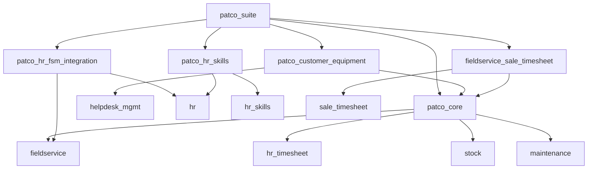
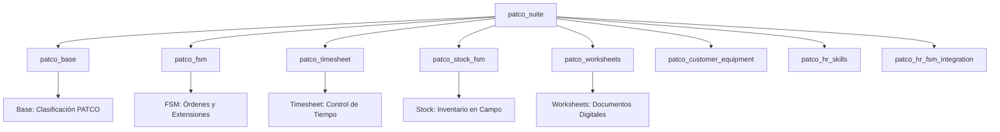
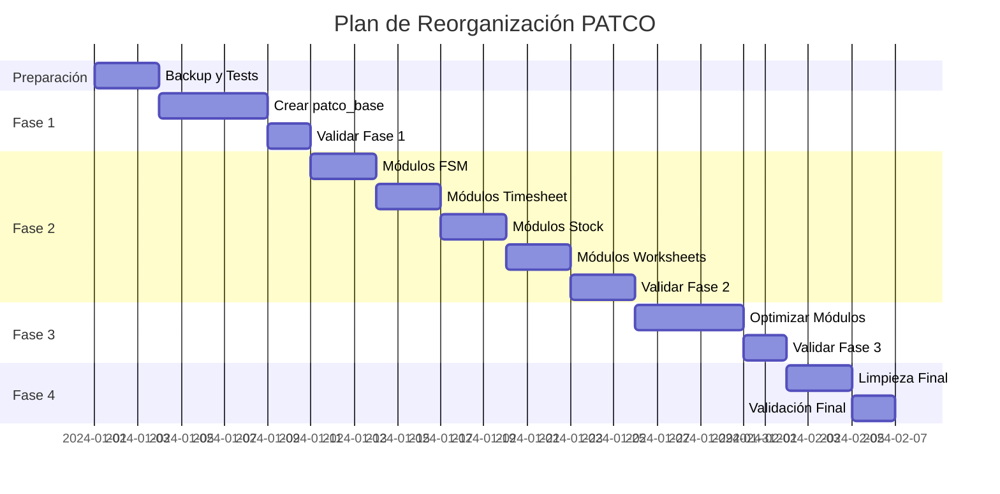

# Mapeo de Módulos PATCO Existentes - Plan de Reorganización Arquitectónica

## Resumen Ejecutivo

Este documento analiza los módulos PATCO actuales que **ya funcionan correctamente** y propone un plan de reorganización hacia la arquitectura objetivo definida en la hoja de ruta, sin interrumpir las operaciones actuales. El enfoque es conservador, priorizando la preservación de funcionalidades mientras se mejora la estructura modular.

## Estado Actual - Inventario de Módulos Funcionales

### Módulos Existentes y su Estado

| Módulo Actual | Estado | Líneas Manifest | Responsabilidades Principales |
|---------------|--------|-----------------|-------------------------------|
| `patco_suite` | ✅ Funcional | ~15 | Orquestador de instalación |
| `patco_core` | ✅ Funcional | ~89 | **SOBRECARGADO** - FSM, Stock, Timesheet, Clasificación |
| `patco_customer_equipment` | ✅ Funcional | ~25 | Gestión de activos con QR |
| `patco_hr_fsm_integration` | ✅ Funcional | ~20 | Sincronización HR-FSM |
| `patco_hr_skills` | ✅ Funcional | ~18 | Habilidades técnicas HORECA |
| `fieldservice_sale_timesheet` | ✅ Funcional | ~12 | Puente FSM-Timesheet |

### Análisis de Dependencias Actuales



## Mapeo hacia Arquitectura Objetivo

### Arquitectura Objetivo Propuesta



### Matriz de Migración de Funcionalidades

| Funcionalidad Actual | Módulo Origen | Módulo Destino | Complejidad | Riesgo |
|---------------------|---------------|----------------|-------------|--------|
| **Clasificación PATCO** | `patco_core` | `patco_base` | 🟡 Media | 🟢 Bajo |
| **Modelos nature/area/complexity** | `patco_core` | `patco_base` | 🟢 Baja | 🟢 Bajo |
| **Extensiones fsm.order** | `patco_core` | `patco_fsm` | 🟡 Media | 🟡 Medio |
| **Control de tiempo FSM** | `patco_core` | `patco_timesheet` | 🟡 Media | 🟡 Medio |
| **Stock en vehículos** | `patco_core` | `patco_stock_fsm` | 🔴 Alta | 🟡 Medio |
| **Hojas de trabajo digitales** | `patco_core` | `patco_worksheets` | 🟡 Media | 🟢 Bajo |
| **Gestión de activos QR** | `patco_customer_equipment` | **MANTENER** | 🟢 Baja | 🟢 Bajo |
| **Sincronización HR-FSM** | `patco_hr_fsm_integration` | **MANTENER** | 🟢 Baja | 🟢 Bajo |
| **Habilidades HORECA** | `patco_hr_skills` | **MEJORAR** | 🟡 Media | 🟢 Bajo |
| **Puente Timesheet** | `fieldservice_sale_timesheet` | **DEPRECAR** | 🟢 Baja | 🟢 Bajo |

## Plan de Reorganización Conservador

### Fase 0: Preparación (Sin Cambios Funcionales)

#### Objetivos
- Crear respaldo completo del sistema actual
- Establecer suite de tests de regresión
- Documentar estado actual de datos

#### Tareas Críticas
```bash
# 1. Backup completo
git checkout -b backup/pre-refactoring
git add -A && git commit -m "Backup: Estado funcional antes de refactoring"

# 2. Crear branch de trabajo
git checkout -b refactoring/modular-architecture

# 3. Tests de compatibilidad
python -m pytest tests/test_current_functionality.py
```

#### Entregables
- [ ] Backup verificado del sistema actual
- [ ] Suite de tests de funcionalidad existente
- [ ] Documentación de configuración actual
- [ ] Plan de rollback definido

### Fase 1: Crear Módulo Base (Semana 1)

#### Objetivo: Extraer Fundamentos sin Romper Sistema

#### 1.1 Crear `patco_base` - Fundación Modular

**Contenido a Migrar desde `patco_core`:**
```python
# Archivos a COPIAR (no mover aún):
# patco_core/models/patco_service_nature.py -> patco_base/models/patco_service_nature.py
# patco_core/models/patco_service_area.py -> patco_base/models/patco_service_area.py
# patco_core/models/patco_service_complexity.py -> patco_base/models/patco_service_complexity.py
# patco_core/data/patco_service_*_data.xml -> patco_base/data/
```

**Estructura `patco_base`:**
```
patco_base/
├── __manifest__.py
├── models/
│   ├── __init__.py
│   ├── patco_service_nature.py      # COPIADO desde patco_core
│   ├── patco_service_area.py        # COPIADO desde patco_core
│   ├── patco_service_complexity.py  # COPIADO desde patco_core
│   └── maintenance_equipment_category.py  # Extensiones base
├── data/
│   ├── patco_service_nature_data.xml     # COPIADO desde patco_core
│   ├── patco_service_area_data.xml       # COPIADO desde patco_core
│   └── patco_service_complexity_data.xml # COPIADO desde patco_core
├── security/
│   ├── patco_security.xml           # Grupos base
│   └── ir.model.access.csv
└── views/
    └── patco_base_views.xml         # Vistas de configuración
```

**Manifest Conservador:**
```python
# patco_base/__manifest__.py
{
    'name': 'PATCO Base - Fundación Modular',
    'version': '18.0.1.0.0',
    'category': 'Technical/Base',
    'summary': 'Módulo base con clasificaciones fundamentales PATCO',
    'depends': [
        'base',
        'maintenance',
        # Solo dependencias esenciales
    ],
    'data': [
        'security/patco_security.xml',
        'security/ir.model.access.csv',
        'data/patco_service_nature_data.xml',
        'data/patco_service_area_data.xml',
        'data/patco_service_complexity_data.xml',
        'views/patco_base_views.xml',
    ],
    'installable': True,
    'application': False,
    'auto_install': False,
}
```

#### 1.2 Actualizar `patco_suite` para Incluir Base

```python
# patco_suite/__manifest__.py (actualización)
{
    'depends': [
        'patco_base',        # NUEVA dependencia
        'patco_core',        # Mantener temporalmente
        'patco_customer_equipment',
        'patco_hr_fsm_integration',
        'patco_hr_skills',
        'fieldservice_sale_timesheet',
        # ... resto igual
    ],
}
```

#### Validación Fase 1
```bash
# Instalar patco_base sin afectar sistema actual
odoo-bin -d test_db -i patco_base --test-enable --stop-after-init

# Verificar que patco_core sigue funcionando
python -m pytest tests/test_patco_core_functionality.py
```

### Fase 2: Modularización Gradual (Semanas 2-4)

#### 2.1 Crear `patco_fsm` - Extensiones Field Service

**Contenido a Migrar:**
```python
# Archivos a MOVER desde patco_core:
# patco_core/models/fsm_order.py -> patco_fsm/models/fsm_order.py
# patco_core/views/fsm_order_views.xml -> patco_fsm/views/fsm_order_views.xml
# patco_core/views/fsm_order_checklist_views.xml -> patco_fsm/views/fsm_order_checklist_views.xml
```

**Dependencias Actualizadas:**
```python
# patco_fsm/__manifest__.py
{
    'name': 'PATCO Field Service Management',
    'depends': [
        'patco_base',           # Nueva dependencia base
        'fieldservice',
        'fieldservice_skill',
        # Remover dependencias innecesarias
    ],
}
```

#### 2.2 Crear `patco_timesheet` - Control de Tiempo

**Contenido a Migrar:**
```python
# Archivos a MOVER desde patco_core:
# patco_core/models/account_analytic_line.py -> patco_timesheet/models/account_analytic_line.py
# patco_core/views/account_analytic_line_views.xml -> patco_timesheet/views/account_analytic_line_views.xml
```

#### 2.3 Crear `patco_stock_fsm` - Inventario en Campo

**Contenido a Migrar:**
```python
# Archivos a MOVER desde patco_core:
# patco_core/models/fsm_order_consumed_part.py -> patco_stock_fsm/models/fsm_order_consumed_part.py
# patco_core/models/stock_location.py -> patco_stock_fsm/models/stock_location.py
# patco_core/models/stock_transfer_request.py -> patco_stock_fsm/models/stock_transfer_request.py
```

#### 2.4 Crear `patco_worksheets` - Documentos Digitales

**Contenido a Migrar:**
```python
# Archivos a MOVER desde patco_core:
# patco_core/models/fsm_worksheet.py -> patco_worksheets/models/fsm_worksheet.py
# patco_core/wizards/fsm_worksheet_*.py -> patco_worksheets/wizards/
# patco_core/views/fsm_worksheet_*.xml -> patco_worksheets/views/
```

### Fase 3: Optimización de Módulos Existentes (Semana 5)

#### 3.1 Mejorar `patco_hr_skills`

**Problema Actual:** Falta integración con `fieldservice_skill`

**Solución Conservadora:**
```python
# patco_hr_skills/__manifest__.py (actualización)
{
    'depends': [
        'patco_base',           # Nueva dependencia
        'hr_skills',
        'fieldservice_skill',   # AÑADIR dependencia faltante
        'hr',
    ],
}
```

**Extensión de Funcionalidad:**
```python
# patco_hr_skills/models/hr_employee.py (mejora)
class HrEmployee(models.Model):
    _inherit = 'hr.employee'
    
    # Integración con fieldservice_skill
    fieldservice_skill_ids = fields.One2many(
        'fieldservice.worker.skill',
        'worker_id',
        string='Habilidades de Campo'
    )
    
    @api.model
    def sync_skills_to_fieldservice(self):
        """Sincronizar habilidades HR con Field Service"""
        for employee in self.search([('is_fsm_worker', '=', True)]):
            # Lógica de sincronización mejorada
            pass
```

#### 3.2 Mantener `patco_customer_equipment` (Sin Cambios)

**Justificación:** Módulo bien estructurado, funcionalidad específica y cohesiva.

**Única Mejora:** Actualizar dependencia base
```python
# patco_customer_equipment/__manifest__.py (mínima actualización)
{
    'depends': [
        'patco_base',           # Cambiar de patco_core a patco_base
        'maintenance',
        'helpdesk_mgmt',
        'fieldservice',
    ],
}
```

#### 3.3 Mantener `patco_hr_fsm_integration` (Sin Cambios)

**Justificación:** Funcionalidad específica y bien delimitada.

### Fase 4: Limpieza y Consolidación (Semana 6)

#### 4.1 Reducir `patco_core` a Mínimo Funcional

**Después de las migraciones, `patco_core` debe contener solo:**
```python
# patco_core/__manifest__.py (reducido)
{
    'name': 'PATCO Core - Funcionalidades Centrales',
    'depends': [
        'patco_base',
        'patco_fsm',
        'patco_timesheet',
        'patco_stock_fsm',
        'patco_worksheets',
        # Solo orquestación, no funcionalidad directa
    ],
    'data': [
        # Solo configuraciones que requieren todos los módulos
        'data/patco_integration_data.xml',
    ],
}
```

#### 4.2 Deprecar `fieldservice_sale_timesheet`

**Estrategia:** Marcar como deprecado, funcionalidad movida a módulos especializados
```python
# fieldservice_sale_timesheet/__manifest__.py (deprecación)
{
    'name': 'Field Service Sale Timesheet (DEPRECATED)',
    'summary': 'DEPRECATED: Funcionalidad movida a patco_timesheet',
    'installable': False,  # Marcar como no instalable
}
```

## Matriz de Compatibilidad y Validación

### Tests de Regresión Obligatorios

| Funcionalidad | Test Actual | Test Post-Migración | Estado |
|---------------|-------------|---------------------|--------|
| Clasificación PATCO | ✅ | ⏳ Pendiente | Crítico |
| Órdenes FSM | ✅ | ⏳ Pendiente | Crítico |
| Control de Tiempo | ✅ | ⏳ Pendiente | Crítico |
| Stock en Vehículos | ✅ | ⏳ Pendiente | Crítico |
| Hojas de Trabajo | ✅ | ⏳ Pendiente | Alto |
| Códigos QR Activos | ✅ | ⏳ Pendiente | Alto |
| Sincronización HR-FSM | ✅ | ⏳ Pendiente | Medio |
| Habilidades Técnicas | ✅ | ⏳ Pendiente | Medio |

### Checklist de Validación por Fase

#### Fase 1 - Validación `patco_base`
- [ ] Modelos PATCO accesibles desde otros módulos
- [ ] Datos maestros cargados correctamente
- [ ] Vistas de configuración funcionales
- [ ] Permisos de seguridad operativos
- [ ] `patco_core` sigue funcionando sin cambios

#### Fase 2 - Validación Módulos Especializados
- [ ] `patco_fsm`: Órdenes FSM funcionan igual que antes
- [ ] `patco_timesheet`: Control de tiempo preservado
- [ ] `patco_stock_fsm`: Movimientos de stock correctos
- [ ] `patco_worksheets`: Documentos digitales operativos
- [ ] Dependencias entre módulos resueltas

#### Fase 3 - Validación Optimizaciones
- [ ] `patco_hr_skills`: Integración FSM mejorada
- [ ] `patco_customer_equipment`: QR codes funcionando
- [ ] `patco_hr_fsm_integration`: Sincronización activa
- [ ] Todas las funcionalidades originales preservadas

#### Fase 4 - Validación Final
- [ ] `patco_core` reducido pero funcional
- [ ] `fieldservice_sale_timesheet` deprecado sin impacto
- [ ] Suite completa instalable y operativa
- [ ] Performance igual o mejor que estado original
- [ ] Documentación actualizada

## Plan de Rollback

### Estrategia de Recuperación

1. **Rollback Inmediato:** `git checkout backup/pre-refactoring`
2. **Rollback Parcial:** Desinstalar módulos nuevos, mantener originales
3. **Rollback de Datos:** Restaurar backup de base de datos

### Puntos de Control

| Fase | Punto de Control | Acción si Falla |
|------|------------------|------------------|
| 1 | `patco_base` instalado | Desinstalar, continuar con original |
| 2 | Módulos especializados | Rollback a Fase 1 |
| 3 | Optimizaciones | Rollback a Fase 2 |
| 4 | Limpieza final | Rollback a Fase 3 |

## Cronograma Conservador



## Beneficios de la Reorganización

### Arquitectónicos
- **Alta Cohesión:** Cada módulo tiene responsabilidad específica
- **Bajo Acoplamiento:** Dependencias claras y mínimas
- **Mantenibilidad:** Código organizado por dominio funcional
- **Escalabilidad:** Fácil añadir nuevas funcionalidades

### Operacionales
- **Instalación Selectiva:** Instalar solo módulos necesarios
- **Debugging Simplificado:** Problemas localizados por módulo
- **Testing Granular:** Tests específicos por funcionalidad
- **Documentación Clara:** Cada módulo autodocumentado

### De Desarrollo
- **Desarrollo Paralelo:** Equipos pueden trabajar en módulos independientes
- **Releases Independientes:** Actualizar módulos por separado
- **Reutilización:** Módulos base reutilizables en otros proyectos
- **Estándares OCA:** Alineación con mejores prácticas de la comunidad

## Conclusiones

Este plan de reorganización preserva completamente la funcionalidad actual mientras mejora significativamente la arquitectura del sistema. El enfoque conservador garantiza que:

1. **No se pierde funcionalidad** durante la migración
2. **El sistema sigue operativo** en todo momento
3. **Los riesgos están controlados** con puntos de rollback
4. **La mejora es incremental** y validada en cada paso
5. **El resultado final** cumple con principios de arquitectura sólida

La implementación de este plan resultará en un sistema PATCO más mantenible, escalable y alineado con las mejores prácticas de desarrollo de módulos Odoo, sin comprometer la estabilidad operacional actual.